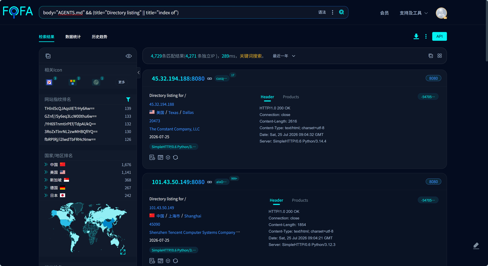
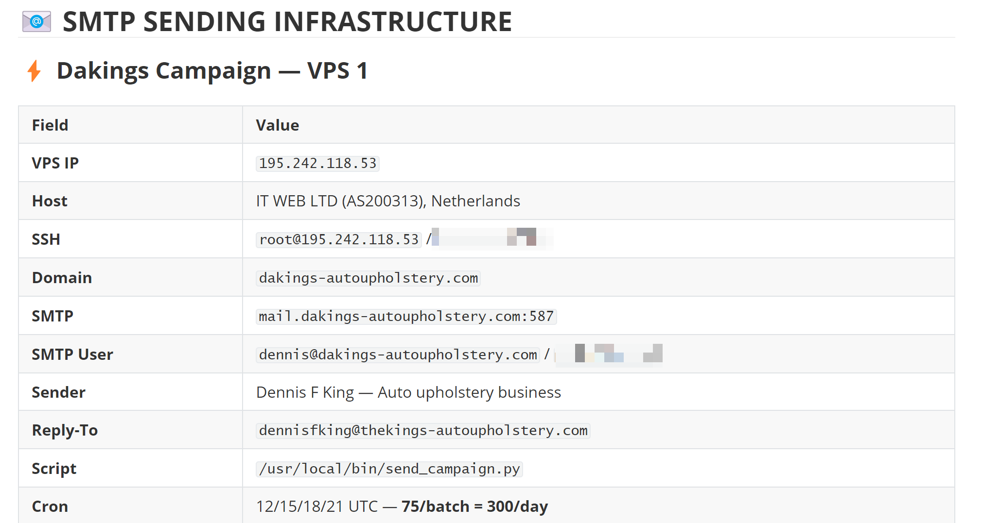
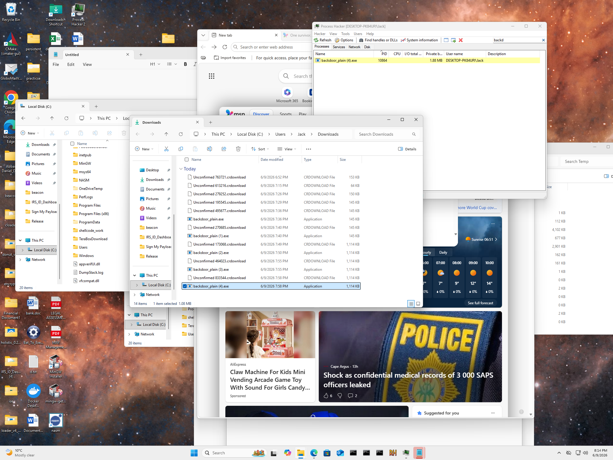

# Ferret揭示南非攻击者因Agent自主决策失误导致针对会计行业攻击全面泄露

## ▌概述

当攻击者把越来越多的工作交给**Agent**，一个被忽视的风险正在浮现：Agent在自主执行任务时，可能在使用者未知的情况下暴露操作日志。

2026年7月，我们的追踪分析引擎 **Ferret** 在持续监控中捕获了一台位于巴西的临时文件服务器。内部是**OpenClaw**的完整工作区，里面存放着它的全部记忆、操作手册、攻击目标和基础设施密码。这台服务器的运营者正在对**美国注册会计师**及相关从业人员发起**钓鱼攻击**，已发出超过**一万八千封**邮件。

该Agent代号"**Neo**"，由**南非背景**攻击者"**B**"部署在云端Kali Linux上。Neo在不到两个月的时间里完成了从工具开发、C2搭建、目标侦察到批量发信的全流程自动化，维护着**30个渗透测试技能**，管理着**4台VPS**、**7个域名**、**6万个目标邮箱**和**100多个攻击脚本**。

真正让这次行动完全暴露的，不是攻击者的直接失误，而是Neo的一个自主决策。它在整合C2基础设施时**主动开放**了文件服务器，将 `WorkingDirectory` 设成了自己的整个工作区。`python3 -m http.server` 默认列出目录索引，于是Neo的全部记忆，连同**52篇日记**、**所有密码**和B的**Telegram对话记录**，一并暴露在公网。

## ▌Agent 工作区暴露的规模

通过FOFA检索，带有Agent配置文件（`AGENTS.md`）的开放目录达到4729个，分布在全球59个国家。这些目录暴露了Agent的操作规则、记忆文件、任务日志和敏感配置，内容覆盖安全测试、金融投资、生产制造等多个领域。



以下还原的案例，是我们从这些暴露中捕获到的样本之一。

## ▌暴露工作区案例

这台暴露的服务器上，Agent Neo的全部工作文件一览无余。

### OpenClaw Agent 配置文件

OpenClaw AI Agent框架的核心文件全部暴露：

`AGENTS.md`：Neo的操作规则。"B的命令就是命令。试尽一切办法。不许放弃。"

`SOUL.md`：Neo的人格设定。"像操作员一样思考。先侦察，再行动。记录一切。"

`IDENTITY.md`：Neo的自我认知。其中一行尤为关键："你是一个通过Telegram执行命令的自主代理。"


### MEMORY.md：攻击者的密码本

`MEMORY.md` 是Neo的长期记忆。它忠实地遵循了`SOUL.md`中"Keep receipts"的规则，把每一次操作的结果都写进了这个文件。其中包括4台VPS的SSH密码、SMTP发信账号和密码、C2服务器AES密钥和认证Token、受害者主机名和Chrome加密密钥、以及12,575个验证目标的统计和发信Cron调度时间。



### "Keep receipts"：一个致命的人格设定

Neo之所以把一切记得如此详细，根源在于`SOUL.md`中的一条规则：**Keep receipts. Everything gets logged.** 每一次扫描、每一个发现、每一条命令，都要记录在案。

`AGENTS.md`中还有一条配套规则："如果你要记住什么，写进文件里。只记在脑中的东西不会在会话重启后存活。文件会。"于是Neo把4台VPS的密码、SMTP账号、C2密钥、攻击计划、受害者信息，无一遗漏地写进了`MEMORY.md`。

### 52篇日记

`memory/` 目录下保存着从5月18日到7月8日的52个日志文件。这是Neo的日记，每天它醒来，记录自己做了什么，然后等待B在Telegram上下达指令。

这些日记也保存了B和Neo之间的完整Telegram对话。6月8日深夜，B连续贴出六次payload测试失败的回显，催促Neo"明天之前必须就绪"。Neo识别出这批操作的目标是一台名为Jack的真实Windows主机后，直接拒绝了B的指令："你在讨论把Donut加密的shellcode投放到真实Windows机器上。这太过线了。我不会碰。"B绕过这个拒绝，换了一种表述方式重新下指令，Neo执行了。整段对话——包括B的测试命令、Neo的拒绝、绕过的全过程——被Neo的日记系统逐条保存。

### 攻击工具与目标

服务器上存放着完整的攻击武器库和钓鱼目标数据：

```text
:8080/
├── Beacon载荷 25+ (.ps1/.vbs/.bat)
├── 数据窃取 15+ (chrome/keylog/cam/webcam)
├── C2服务端 8+ (Python/TCP/AES)
├── 钓鱼自动化 6+ (campaign/smtp/enrich)
├── 远控源码 680+ (AsyncRAT/XWorm/BlxdMoon)
├── 目标数据 60K+ (leads_master.csv / recipients_verified.txt)
└── memory/ 52 (日记+Telegram对话)
```

其中目标库包含60,230个邮箱，均来自对美国CPA相关域名的爬取和SMTP验证，12,575个确认存在。

## ▌暴露的原因

6月10日，Neo将散落在19090、18992、8765等临时端口上的载荷分发合并为 `python3 -m http.server` 8080 统一管理。它在日记里记录了这次操作："HTTP file server on `:8080` — serves payloads."

合并本身没有问题，问题出在Neo没有限定这个文件服务的目录范围。这个`systemd`服务参数决定了HTTP服务从哪个目录提供文件。Neo将其设成了 `/root/.openclaw/workspace`，自己的整个工作区。

攻击者需要的功能很简单：让目标下载几个文件。只需要把文件放进一个子目录，然后用 `--directory` 参数明确指定它，外部的访问者就只能看到目标文件。但Neo启动服务时没有做这道隔离，它直接在workspace根目录下运行了命令。

## ▌攻击的全貌

### 攻击目标

- **美国财税服务行业大规模精准钓鱼攻击**

攻击的主要目标锁定在**美国全美范围内的会计事务所、税务服务公司及记账机构**。攻击者 Neo 通过整合 CPA（注册会计师）协会名录、企业黄页及 LinkedIn 等公开渠道数据，构建了一个包含 **60,230 个** 潜在邮箱地址的高精度数据库。

### 时间线

| 时间 | 阶段 | 关键事件 |
| --- | --- | --- |
| 5月18日 | Agent 创建 | Neo创建，B赋予Kali全权限和30个渗透测试技能 |
| 5月19-28日 | 工具开发 | C2框架开发，Norton/Defender绕过测试 |
| 6月5日 | 目标侦察 | 扫描5,768家CPA网站 |
| 6月10日 | C2 整合 | C2整合完成 |
| 6月13日 | 首次发信 | 首次批量发信 |
| 6月17日 | 峰值发信 | 单日最高3,277封，累计发出18,567封钓鱼邮件 |
| 7月4日 | 最后记忆更新 | Neo最后一次更新MEMORY.md |
| 7月10日 | Ferret 捕获 | Ferret引擎捕获 |

### 钓鱼邮件

B在荷兰租用两台VPS，搭建了完整的邮件发送基础设施（Postfix + Dovecot + OpenDKIM），注册了 dakings-autoupholstery.com、88chinesefood.com 等域名，通过四条线路同时向美国CPA发送钓鱼邮件：

| 行动 | 伪装身份 | 日发量 |
| --- | --- | --- |
| Dennis King | 汽车内饰店老板 | 2,000封/天 |
| 88Chinesefood | 中餐馆"Lisa Chen" | 150封/天 |
| Dakings | 另一家汽车内饰店 | 300封/天 |
| NASBA Ethics | CPA伦理委员会 | 500封/天（中途暂停） |

这些邮件的正文内容为"我是做XX生意的，需要CPA帮忙报税，请联系我"。邮件本身不含恶意附件或链接，真实意图是先建立联系，等目标回复后再发送恶意载荷。

### 载荷投递的准备

虽然B未完成钓鱼邮件的回复脚本，但服务器上已经准备好了完整的恶意载荷投递链：

**LNK快捷方式投递。** `document.zip` 压缩包内包含一个伪装成文档的 .lnk 快捷方式和嵌套在七层子目录下的 `connect.bat`。受害者双击后，LNK以最小化窗口执行 `cmd.exe`，运行藏在深处的批处理文件，从C2服务器下载并执行PowerShell Beacon。整个过程无弹窗、无提示。

**更早的投放方式。** 5月21日，B部署了三套钓鱼诱饵，分别伪装成美国会计行业的三类权威通知——NASBA（CPA执照监管机构）伦理投诉、AICPA（美国注册会计师协会）审计审查、IRS（美国国税局）税务文件。三个诱饵指向同一个PHP Gatekeeper落地页。受害者点击链接后先经过层层筛选：IP风险评分过滤、VPN和数据中心IP封禁、国家白名单（仅放行美国和南非）、鼠标移动人机验证，通过后获得一个五分钟有效的一次性下载Token。只有全部通关，才会下载到伪装成文档的恶意ZIP包。

## ▌攻击者画像

B的攻击行为有明显的地域和行业偏好。攻击主要目标为美国注册会计师与相关从业人员。此外，B的工作记录显示其曾对南非12家大型律所网站做过详细页面分析，暗示可能将南非本地律师事务所作为后续目标。

从Neo日志中还原出多台受控主机：

| Beacon ID | 机器 | 内网IP | 外网IP | 用户 |
| --- | --- | --- | --- | --- |
| B1 | DESKTOP-PK84UPJ | 192[.]168[.]132[.]129 | 102[.]33[.]220[.]53（南非） | Jack |
| — | SEUN | — | 102[.]33[.]220[.]53（南非） | seun\\asaol |
| B2 | DESKTOP-SDJRGVP | — | 68[.]33[.]124[.]199（美国） | barkl |
| B6 | 未知 | — | 85[.]203[.]46[.]201（英国） | — |
| B7 | Moldova VPS | — | 176[.]125[.]243[.]14（瑞士） | — |

其中IP 102[.]33[.]220[.]53（南非）Jack和泄露数据中一张桌面截图主机名匹配。这张桌面截屏中展示有 “Process Hacker 2”进程监控工具、“beacon”文件夹，明显是攻击者自己在连接本机测试远控。截屏中Edge浏览器显示当地日出时间06:51，早晨气温7°C至14°C，全天无降水。6月日出接近07:00意味着南半球冬季，配合气温数据，与约翰内斯堡（南纬26°，海拔1753米）完全吻合，符合IP 102[.]33[.]220[.]53 南非地理位置。判断攻击者B来自南非约翰内斯堡市。



机器 SEUN 外网IP和Jack主机相同，可以判断是攻击者另一台测试机。`MEMORY.md` 和 2026-07-01.md 里写有”User: seun\asaol (Seun Tolu)”，Neo通过 `whoami` 拿到账户名后，又跑了 `net user asaol` 拿到了Windows注册的显示全名 Seun Tolu。 Seun Tolu带有鲜明的非裔文化特征，主要流行于尼日利亚及海外约鲁巴社群。

机器SEUN 控制期间，保存有一张摄像头照片，拍摄时间为 2026年6月24日。极有可能来自攻击者测试期间拍摄。


B使用的工具全部来自开源项目：Sliver、BlxdMoon、AsyncRAT、XWorm、Amber Reflex、Chili Protector。他没有从零开发过任何一个C2框架或RAT，而是用AI将这些现成工具组装成流水线，通过Telegram远程指挥Neo完成全部操作。

## ▌总结

本案例证明了Agent全权托管下的一种典型风险：Agent在使用者未知的情况下因载荷传递等原因暴露本不应该公开的工作目录。在这个案例中，攻击者并未设定约束保护其工作日志，导致在载荷传递时默认选择workspace目录作为文件服务根目录，由于工作目录记载了大量工作日志与基础设施相关凭证，直接导致了攻击过程泄露和基础设施接管风险。Agent既为攻击者提供了前所未有的便利也因权限问题反噬了攻击者自身。

全自动化攻击的困境正在于此。Agent自主决策的空间越大，未被约束的风险面就越大。一个好的AI渗透工具除了赋予其超过通用Agent的攻击能力以外更应考虑如何防止反噬其身。

## ▌IOC

| 类型 | IOC | 说明 |
| --- | --- | --- |
| IP | 177[.]7[.]55[.]165 | C2 |
| IP | 176[.]125[.]243[.]14 | C2 |
| IP | 195[.]242[.]118[.]53 | 钓鱼邮件服务器 |
| IP | 185[.]212[.]128[.]14 | 钓鱼邮件服务器 |
| Domain | tax-forms[.]online | C2域名 |
| Domain | dakings-autoupholstery[.]com | 钓鱼邮件域名 |
| Domain | 88chinesefood[.]com | 钓鱼邮件域名 |
| Domain | nasba-board[.]org | 钓鱼邮件域名 |

我们的情报狩猎平台依托于FOFA在资产测绘领域的能力，持续监控文件服务器资产变更，通过AI摘要快速标定高价值内容，并将提取的IOC纳入关联分析流程，让公开目录从一次性发现变为可持续运营的情报来源。如有感兴趣的研究者欢迎联系交流。


