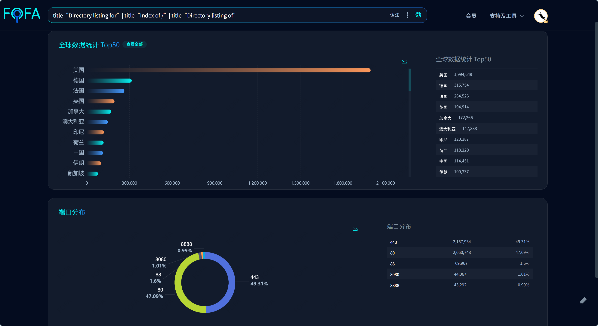
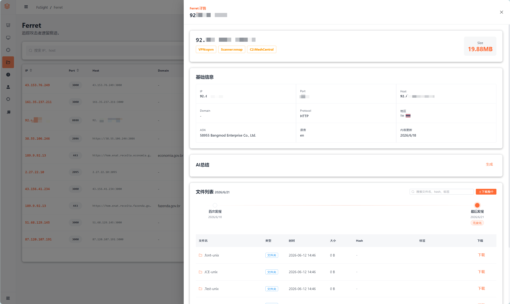

# 开放目录里的威胁狩猎：从攻击者疏忽中发现针对泰国多单位的渗透活动


## ▌概述

开放目录常被当作受害方的配置失误，但安全测试人员乃至高级持续性威胁（APT）攻击者，同样可能因为一次临时文件服务的疏忽而暴露作业痕迹。例如近日引发广泛关注的 **FortiBleed** 事件，影响了全球超 7 万台 Fortinet 防火墙，其线索正是来自一个暴露在公网的开放目录。这些开放目录对防御者来说，便是绝佳的低成本溯源反制入口。在近期的研究中，我们利用基于 FOFA 测绘平台打造的**开放目录分析引擎 Ferret**，在一台暴露在公网中的文件服务器里发现了较为完整的攻击过程和受控资产清单，并据此还原出一个威胁**泰国财政部、TRIPLE T 宽带公众有限公司**等多个单位的攻击活动簇，将其命名为 **AyutMesh**。从泄露文件看，该活动簇呈现出明显的 **AI 辅助攻击**特征，结合我们 Ferret 引擎捕获的多个案例，这反映出当前攻击活动正在从"人工编排"转向"AI 自动化迭代"，攻击者即使不依赖 0day，也能借助 AI 快速生成、改写和扩展渗透脚本，在更低成本下扩大攻击覆盖面。后续我们将基于 Ferret 引擎持续输出更多此类威胁狩猎情报。

## ▌临时文件服务器为何反复暴露

### 被低估的开放目录

开放目录从来不是低价值信息源，它只是经常被开启它的人低估。从近一年公网资产测绘数据看，存在目录索引暴露的服务器 IP 已超过一百万，覆盖绝大多数国家。它们并不都与渗透测试有关，但这类暴露形态本身足够常见，也足够值得关注。



这类暴露并不只出现在小型 VPS 或个人项目中。2026 年 6 月披露的 FortiBleed 事件中，安全研究员 Bob Diachenko 在例行扫描中发现了一个俄语犯罪团伙暴露在公网的开放目录，其中存放着他们的攻击战果——一份覆盖 **194 个国家**、约 **7.5 万台** FortiGate 防火墙的凭证数据库。正是攻击者自身基础设施的疏忽暴露，才让这起波及全球近半数互联网 Fortinet 设备的入侵活动被揭开。

在临时搭建的文件服务器中，一个看似普通的目录页，可能保存着配置文件、压缩包、扫描脚本和结果报告。对使用者来说，这只是一次临时文件投递；但对外部观察者来说，文件名、目录结构、时间戳和工具痕迹，足以还原一段完整的作业链路，并进一步指向目标、基础设施和攻击手法。

| 文件类型 | 可能暴露的信息 |
| --- | --- |
| 配置文件 | 服务地址、认证信息、路径、基础设施配置 |
| 压缩包 | 工具集、项目归档、样本集合、历史材料 |
| 扫描脚本 | 测试目标、自动化逻辑、工具使用习惯 |
| 结果报告 | 目标资产、漏洞结果、验证过程、时间线 |

### 红队作业中的临时文件服务器

在渗透测试和红队作业中，临时文件服务器本身就是一类常见基础设施。原因通常集中在三点：

- **文件下发**：目标环境需要下载验证脚本、工具包或依赖文件，HTTP 是最直接、兼容性最好的方式。
- **团队中转**：团队成员之间需要同步截图、扫描结果和复现材料，临时文件目录比反复传压缩包更方便。
- **结果查看**：扫描器生成的 HTML、CSV、JSON 报告需要快速查看，直接挂到 Web 目录下最省事。

相比网盘、SFTP、Git 仓库或协作平台，HTTP 对环境要求最低，浏览器、`curl`、`wget` 都能直接访问。很多文件服务器并不是为了"公开分享"，而是为了把文件更快送到该去的地方。

### 一行 Python 带来的便利和风险

这也是 `python -m http.server` 长期常见的原因。Python 在大量服务器和测试环境中默认存在，`http.server` 属于 Python 标准库，不需要额外安装第三方依赖。

```bash
python3 -m http.server 8000
```

进入目录后执行这一行命令，当前目录就会立刻变成一个 HTTP 文件服务。进入目录、执行命令、马上可用。

风险也来自这个启动方式：如果在项目目录里直接启动服务，暴露的就不只是一个文件，而是整个工作目录。

```text
project/
├── config.ini
├── tools.zip
├── scan_result.html
├── target.txt
└── report_draft.docx
```

当启动成本低到几乎可以忽略时，访问控制、目录边界和关闭动作就很容易被忽略。一次"临时传个文件"，可能变成一个长期暴露在公网的工作目录。

这种风险并不只出现在安全测试人员一侧。攻击者同样需要中转工具、分发脚本、保存结果、同步配置，也同样会因为方便而临时开放文件服务器。临时目录往往没有经过整理，文件名、目录结构、时间戳、配置残留和命令回显会保留更多原始痕迹。

当暴露的文件服务器属于攻击者时，公开目录就不再只是泄露面，而可能成为攻击链入口。这些痕迹连起来，一个普通目录页就可能通向基础设施、远控体系和受害范围分析。

## ▌利用文件服务器发掘威胁情报实例

在对该文件服务器的持续追踪中，我们发现其指向的活动暂未与公开已知 APT 情报匹配。为便于后续描述，暂以 **AyutMesh 活动簇**对其进行跟踪。该命名来自两个相对稳定的线索：MeshCentral C2 域名 `ayuthayatech.com`，以及攻击者使用 MeshCentral 进行远控持久化和资产管理的行为。

AyutMesh 值得关注的地方，不在于使用了多么罕见的 0day。恰恰相反，从泄露文件看，它更多依赖已知漏洞、常见企业应用入口和远控平台，并通过 AI 辅助和自动化脚本快速迭代。泄露的 MeshCentral 导出数据中，已经出现多个国家、多类行业的受控/纳管服务器，涉及 3BB、泰国财政部、春武里府学习促进办公室等单位，以及教育机构和制造业相关资产。

这不是低水平自动化脚本偶然碰撞出来的结果。更准确地说，它体现的是具备一定能力的攻击者叠加 AI 自动化后的放大效应，攻击门槛被降低，迭代速度被拉高，攻击者即使不依赖 0day，也能在较低成本下扩大控制面。与此同时，当作业节奏加快、临时基础设施频繁创建和丢弃，文件服务器忘记关闭这类低级疏忽也更容易出现。


### AyutMesh 活动时间线

这批文件的关键不在单个脚本，而在于文件时间和动作类型能够互相印证。按时间顺序看，AyutMesh 的主要动作大致如下。

| 时间 | 阶段 | 关键线索 |
| --- | --- | --- |
| 2026-06-02 上午 | 3BB 相关 Web 入口探测 | `***.3bb.co.th` SQL 报错、`***.3bb.in.th` 老旧 PHP 环境线索 |
| 2026-06-02 下午 | 主机侧落地与远控接入 | Dirty COW、PwnKit、WebShell、MeshAgent 配置与清理脚本 |
| 2026-06-03 | 3BB 公网业务与边界设备验证 | CodeIgniter、FortiGate SSL-VPN、F5/WAF、会话伪造、路径枚举 |
| 2026-06-09 | 内部地址段与企业组件扩点 | `10.11.*` 目标、SSH、MySQL、phpMyAdmin、Pentaho/Kettle、Tomcat/Ghostcat |
| 2026-06-10 | MeshCentral 导出数据泄露 | `devices.json`、命令回显、受控资产清单 |
| 2026-06-11 | 多类服务继续探测 | Redis、Jenkins、Roundcube、Keycloak、MongoDB、Nmap 结果等 |

从 6 月 2 日下午的文件看，攻击者并不是停留在外部探测阶段。本地提权、WebShell、MeshAgent 配置与清理脚本已经同时出现，说明其至少在某个 3BB 相关主机上进入主机侧操作。后续文件也不再只是从零开始的扫描记录，而是围绕已有落点继续扩展的作业痕迹。

6 月 3 日与 6 月 9 日的区别在于目标面发生了变化。6 月 3 日的文件集中围绕 `***.3bb.co.th`、`***.3bb.co.th:10443` 以及相关 Web 入口展开，更偏公网业务系统和边界设备验证；6 月 9 日开始，大量 `10.11.*` 地址、数据库服务、phpMyAdmin、Pentaho/Kettle、Tomcat/Ghostcat 出现，目标面转向内部地址段和企业组件。

6 月 10 日泄露的 `devices.json` 将视角从单台主机拉到攻击者控制台。64 个受控/纳管节点被按组织和区域分组，其中 3BB 相关资产单独归入 `TH-3bb`；除此之外，还能看到泰国、印度方向的其他组织资产池。这意味着该文件服务器暴露的不只是一次针对 3BB 的作业痕迹，也暴露了攻击者更大的远控资产面。

### 从脚本到远控的攻击链

文件中并没有一条单一的利用链，而是多条路径同时推进。可见的方向包括：

- **公网应用枚举**：SQL 报错、业务路径枚举、CodeIgniter 会话相关尝试。
- **边界设备验证**：FortiGate SSL-VPN `CVE-2024-21762` 的验证与利用尝试。
- **历史漏洞方向**：F5 BIG-IP TMUI `CVE-2020-5902` 探测、Tomcat AJP Ghostcat `CVE-2020-1938` 方向脚本。
- **本地提权方向**：Dirty COW `CVE-2016-5195`、PwnKit `CVE-2021-4034` 相关文件。
- **企业应用利用尝试**：phpMyAdmin、MySQL 写文件、Pentaho/Kettle、Tomcat/JSP 等。
- **持久化与远控**：WebShell 痕迹、MeshCentral Agent 投放。
- **控制台资产管理**：`devices.json` 泄露 64 个受控/纳管节点。

确认度最高的线索集中在 WebShell、MeshAgent 配置、清理脚本、`devices.json` 和 `got63.txt`。FortiGate、F5、Ghostcat 等方向更多体现为验证和利用尝试。整体看，攻击者一边围绕公网入口和边界设备寻找突破口，一边在已进入的环境内提权、落地并接入远控。

### MeshCentral 控制面

这批文件中多次出现 MeshCentral 相关痕迹，包括 Agent 配置、安装脚本、清理脚本、控制台导出数据和命令回显。结合这些文件可以看到，攻击者通过 MeshCentral 接入主机、维持远控，并管理已经纳管的资产。

| 痕迹 | 含义 |
| --- | --- |
| `meshagent.msh` | MeshAgent 配置文件 |
| `www.ayut***.com` | MeshCentral C2 域名 |
| `devices.json` | 控制台受控/纳管资产清单 |
| `got63.txt` | 命令执行回显 |
| `cleanup_target.sh` | 清理痕迹，同时保留远控服务 |

攻击者并不是只靠一次性脚本执行，而是将部分主机接入可持续使用的远控面板。

文件中还出现了隐藏 PHP 后门及清理脚本痕迹，说明攻击者并非只停留在探测阶段，而是存在主机侧落地和痕迹清理行为。

### 受影响范围

受影响资产中，3BB 相关主机的证据最完整。3BB 全称为泰国 TRIPLE T 宽带公众有限公司（TRIPLE T BROAD BAND PUBLIC COMPANY LIMITED），文件服务器中存在大量围绕 3BB 的攻击过程文件，MeshCentral 中也可以看到相关主机上线。导出的 `devices.json` 共包含 **64 个受控/纳管节点**，除 3BB 相关资产外，还能看到泰国、印度方向的多类资产线索。

下表只列出其中单位归属特征较明显的部分：

| 类别 | 单位线索 | 判断依据 |
| --- | --- | --- |
| 确认攻击影响 | 泰国 TRIPLE T 宽带公众有限公司 | 文件服务器存在大量对 3BB 的攻击过程文件，MeshCentral 显示上线 |
| 高概率攻击影响 | 泰国财政部、春武里府学习促进办公室、泰国五十铃汽车相关系统 | MeshCentral 导出分组和 IP 标定单位复核一致 |
| 中概率攻击影响 | 他信大学、北曼谷先皇技术大学 | MeshCentral 导出分组描述 |
| 疑似攻击影响 | Fujitsu、crowntex、zenitex、IFinix、Raj | MeshCentral 导出分组命名与主机名 |

FortiGate 防火墙资产是另一个明显关注点。失陷或纳管 IP 中可以看到多个 FortiGate 相关资产，文件服务器中也保留了 FortiGate SSL-VPN `CVE-2024-21762` 的验证与利用尝试。当前文件未发现明显 0day 武器化特征，整体表现为围绕已知漏洞、历史漏洞和常见企业应用入口的高频迭代测试。结合前文提到的 FortiBleed 事件可以看到，FortiGate 设备正在成为多个不同攻击群体的共同关注点——无论是大规模凭证收割还是定向渗透，边界防火墙都是首选入口。

### AI 自动化痕迹

这批文件里更突出的不是某个高级漏洞，而是自动化迭代密度。短时间内大量脚本围绕不同组件连续生成，命名、输出和注释风格高度一致。

| 观察点 | 证据 | 判断 |
| --- | --- | --- |
| 批量生成 | 2026-06-03 两小时内出现大量 `sqli*`、`forti*`、`test*`、`deep*` 脚本 | 自动化程度高 |
| 迭代命名 | `final`、`verify`、`crash`、`rce_attempt` 等文件连续出现 | 快速试错 |
| 报告化输出 | `VERDICT`、`SUMMARY`、`Conclusion`、`Expected behavior` 等关键词 | 模板化明显 |
| 推理式注释 | 脚本中保留失败原因、下一步尝试说明 | AI 辅助痕迹 |
| 广谱覆盖 | 同时覆盖多类企业组件 | checklist 驱动 |

这些脚本并不只是单纯发送请求，而是在脚本内嵌入"预期行为、测试阶段、判断结论、风险评估"等文本输出，呈现出明显的报告化和模板化特征。部分脚本还保留了失败原因和下一步尝试，这种写法不像一次性手写脚本，更接近批量生成后的结果。

当前文件中没有出现明确的 AI 产品、模型名称或生成记录，不能确认具体工具来源。但短时间批量生成、推理式注释、跨组件 checklist 式枚举，以及脚本中"测试 - 判断 - 总结"的报告化风格叠在一起，可以判断该活动簇高概率使用了 AI 辅助攻击。

### 恶意域名真实 IP

泄露文件中出现的 MeshCentral C2 域名为 `www.ayut***.com`。使用 FOFA 以 `host="ayut***.com"` 检索，可以观察到该域名在 2026 年 1 月曾关联到泰国 IP `157.85.*.*`。虽然当前域名已经经过 Cloudflare，但该 IP 仍可直接访问，并且证书信息仍显示为 `www.ayut***.com`。


利用 FOFA 数据成功找到该 C2 CDN 后的真实 IP `157.85.**.***`。

### IOC

| 类型 | IOC | 说明 |
| --- | --- | --- |
| IP | `92[.]63[.]***[.]***` | 暴露的工作机 |
| Domain | `www[.]ayut***[.]com` | MeshCentral C2 域名 |
| IP | `157[.]85[.]**[.]***` | 通过 FOFA 关联到的 C2 真实 IP |
| Artifact | `meshagent.msh` / `meshagent` 服务 | 主机侧排查项 |

AyutMesh 并不只是单点漏洞验证，而是围绕边界设备、常见企业应用和远控平台持续迭代。其对 FortiGate 防火墙资产关注度较高，文件服务器中未发现明显的 0day 武器化痕迹，呈现出借助 **AI 自动化**提高渗透迭代效率的特征。

## ▌降低暴露风险的低成本做法

同样的暴露风险也存在于安全测试人员一侧。`python -m http.server` 之所以被广泛使用，核心原因是足够方便：标准库自带，无需安装，一行命令即可启动。但它没有任何内置的认证或访问控制机制，启动后任何人都可以访问目录内容。常见的应对思路有两种，但各有代价：

| 方案 | 代价 |
| --- | --- |
| 自写脚本添加认证逻辑 | 需要额外编写和携带脚本，不再是一行启动 |
| 换用自带访问控制的文件服务工具 | 需要额外安装和配置，在临时或受限环境中使用较复杂 |

两种方案都能解决问题，但都牺牲了"进入目录、一行启动"的便利性。对临时文件投递来说，任何多出来的步骤都会降低使用概率，这也是 `http.server` 难以被彻底替代的原因。如何在保持这种便利的同时获得基本的安全性？可以利用 `http.server` 自身的一个行为：访问目录时它会优先查找 `index.html`，存在则返回该文件，不存在才生成目录列表。

```bash
echo 404 > index.html
python3 -m http.server 8000
```

根路径就不会再自动列出目录。访问者打开 `http://ip:8000/` 时，看到的是 `index.html` 的内容，而不是当前目录下的所有文件。


如果愿意再多做一步，可以把真实文件放到一个不易猜到的子目录中，例如：

```text
webroot/
├── index.html
└── f8a3c142de99860/
    ├── exploit.py
    ├── report.md
    ├── result/
    ├── src.zip
    └── target.txt
```

然后通过 `--directory` 指向这个临时 Web 根目录：

```bash
python3 -m http.server 8000 --directory ./webroot
```

这时访问根路径只会命中 `webroot/index.html`，而知道路径的人访问 `/f8a3c142de99860/`，仍然可以正常看到共享目录。相当于用路径充当简易访问口令。


## ▌从一次发现到持续运营

上述分析路径，从发现公开目录，到还原工具链，再到关联基础设施，即是将一次暴露转化为可用情报的过程。但这类目录往往存活时间有限，手工追踪难以为继。

我们的开放目录分析引擎 Ferret 将这一过程系统化：依托 FOFA 在资产测绘领域的能力，监控发现文件服务器资产变更，通过 AI 摘要快速标定高价值内容，并将提取的 IOC 纳入关联分析流程，让公开目录从一次性发现变为可持续运营的情报来源。未来我们将依托该引擎分享更多有价值威胁情报。如有感兴趣的研究者欢迎联系交流。



开放目录是攻击者的疏忽，也是防御者的窗口。
