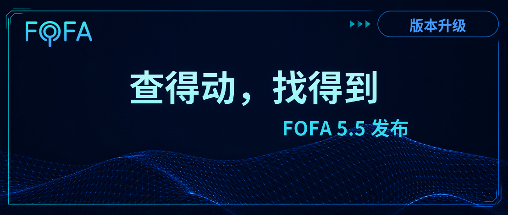
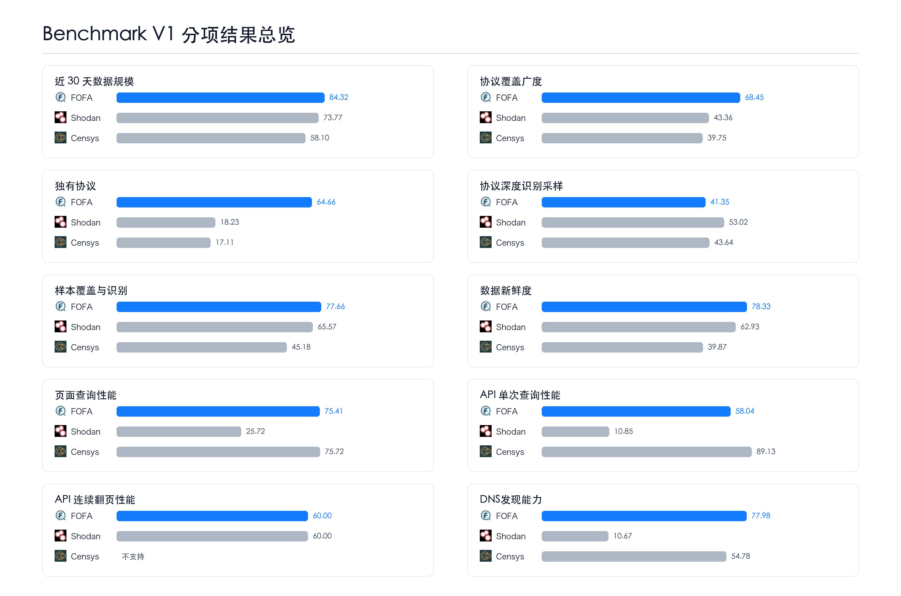
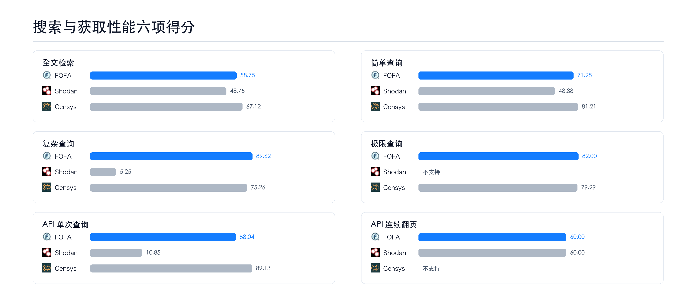
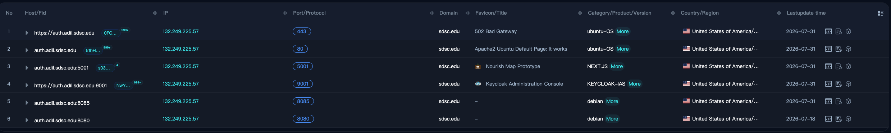
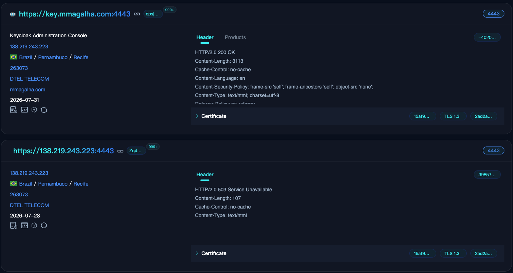
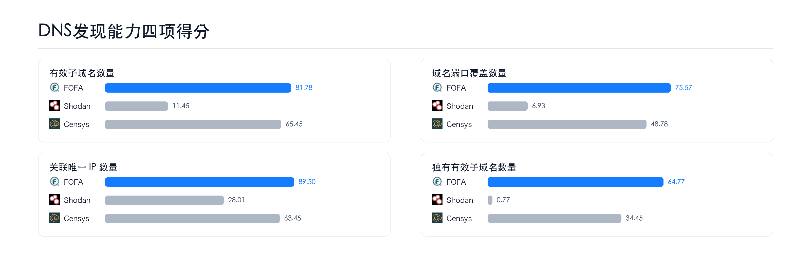
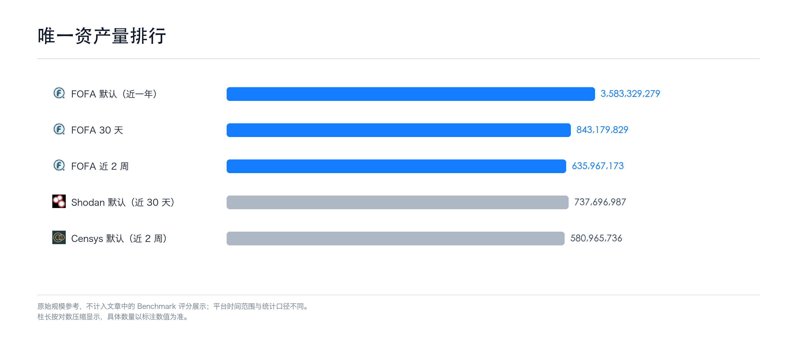

# 查得动，找得到：FOFA 5.5 发布

*搜索更快，发现更主动*

## 写在前面

网络空间测绘有一个绕不开的事实：资产永远在变多。

今年前七个月，FOFA 的新注册用户已达去年全年的 **144%**。用户在涨，数据也在涨。增长当然是好事，但增长从不免费，数据规模每上一个台阶，搜索就得重新考试。师傅们只是进行一次正常的复杂查询，等待的时间却越来越长，有时直接搜索失败。

而域名的问题则更隐蔽。有的子域名没被发现；有的资产已经在库里，拿着域名去搜却搜不到，不是不存在，只是域名、IP 和端口之间的路，过去没接上。

两个问题，解法不同，但道理一样：**技术有扛不住的天花板，资源有堆不出的答案。两条腿，缺一不可。**

但进步与否，自己说了不算。和自己对比只能说明"我们变好了"，站到行业里才知道"我们在哪"。所以我们沉淀了一版**《网络空间测绘平台 Benchmark V1》**评测标准。

本次 Benchmark 先选了 Shodan 和 Censys。其他平台这两年的进步我们一直关注，有些方向确实做得好。只是这次还没能在同一套条件下完成测试，暂未纳入其中。

这次升级的重头是两件事：让默认范围的搜索更快、更稳定；把更多真实子域名找出来。

## 一、搜索性能的提升

先说第一件——搜索性能。  
不同平台应对数据规模的方式不同。Shodan 主展示过去 30 天内的资产，且跨特征不支持复杂查询。Censys 展示过去 2 周的资产，官方称为“已知资产”，且个人用户可用功能有限，主要服务于企业客户。而 FOFA 主展示近一年资产，且全部历史资产可查。所以 FOFA 要解决的是十亿级、百亿级的性能压力。

这个压力，我们最初想靠技术升级单独扛下来。试过，没扛住。数据规模和用户数达到一个量级，纯技术优化有天花板。

所以这个版本同步升级了软件和硬件，把整个搜索链路做了一轮扩容与重构。第一批增强先落在默认范围上，这是用户打开 FOFA 最先接触、使用频率最高的那块数据。

查询与数据获取性能，Benchmark 对比结果如下：

更长时间跨度的历史资产搜索，近期也会完成升级。

## 二、高价值域名的主动发现

如果说性能的问题是技术遇到了天花板，那域名的问题就是资源遇到了边界。

所谓"发现得不够"，指的是根域名及其背后的子域名。行业里最直接的思路是堆资源，简单说，就是堆 DNS 库。这条路 FOFA 走过，也会继续走。

但有一个现实绕不过去：没有谁能把全世界的 DNS 都买下来。区域化服务、临时业务、第三方系统和刚出现的入口，总会落在已有资源覆盖之外。资源能堆起来的始终有限，剩下的得靠技术去找。域名发现不能只靠堆库，还要有自己的发现能力。

FOFA 选择把主动发现投入到高价值域名上。什么是高价值域名？我们认为：高流量域名、上市公司的域名属于高价值域名。这些域名自动进入高价值域名池，更新周期会更快，并执行 FOFA 自研的子域名发现程序。

**自适配动态字典池。** 基于高价值域名池，FOFA 把多年积累的子域名前缀做成了一套动态字典，针对不同域名的特征动态适配，去发现更多子域名，包括通过资源无法获取的那部分。

还有一类问题：资产在库里，但域名搜不到。

- 有些域名的主站端口是关的，服务只挂在非标端口上，过去走到入库环节就被当成"打不开"丢弃；
- 用户用域名直接搜搜不到，只能绕去提 IP 反查；
- 同一服务，IP+端口和域名+端口访问，返回的内容还不一致。

**非标端口域名绑定**把域名和非标端口之间的绑定关系补上，入库不再丢弃，用户用域名直接搜就能找到，域名+端口访问也能拿到正确的响应。

这些能力不只是为了把子域名列表做长，而是让原本游离在资产台账之外的真实入口，能被重新看见。

这轮升级完成后，以上市公司域名和高流量域名为样本，内部 Benchmark 测试结果如下：

从结果看，Shodan 的重心一如既往在协议识别上，DNS 发现仍然不是它的主攻方向。Censys 则在 DNS 方向持续投入，已经能看到明显的进展。

先把子域名找出来，再把域名和服务的关系接上，用户才不必因为一条断掉的记录反复绕路。

但这条路还没走完。主动发现找出更多资产的同时，泛解析等问题也会一起出现，影响有效结果占比。这个版本先把"找出"往前推了一步；下一个版本，FOFA 还要继续把"找得准"做扎实。

## 三、其他更新

除此之外，该版本同时更新以下内容：

- 移动端适配，可完成从搜索到数据下载全流程；
- 网站资产与 HTTP/HTTPS 协议数据去重；
- 新增规则产品 100+；
- 新增&优化协议：ZMTP、RTCM、Zeroconf、mDNS、Socks、ethereum-p2p、ethereumrpc、P4 等；
- 体验优化；
- BUG 修复。

## 写在最后

和资产的斗智斗勇，从来不会停歇。

它们在变多，在迁移，在藏进非标端口，躲在域名的背面。你以为已经看清了，转眼又有新的入口出现在意料之外的地方。这不是系统出了问题，是网络空间的本性——资产不会乖乖待在台账上等你来翻。

该版本交了两份答卷。搜索做快了，还要覆盖更长的时间跨度；域名找出来了，还要做得更准。技术有扛不住的天花板，资源有堆不出的答案，但这两条腿不能停——因为只要停一刻，就又有入口从视线里溜走。

时间有限，很多友商值得学习的能力还未加入Benchmark。Shodan 的全量协议识别深度、截图和历史趋势功能的流畅度；Censys 对字段的精细化拆分、IP 视角下的历史趋势与端口变更；国内友商的网站渲染识别、单协议的超高覆盖度、多跳转记录、IP 地理位置库的精确度——都做出了自己的特色，有些方向已经走在了前面。

网络空间测绘还远没有走到终局。各家都在不同方向上往前拱，愿大家一起把这件事做得更好，共勉。

搜不到，不代表不存在。让每一个真实存在的入口都被看见，不管它藏在哪个端口、绕了多少层域名——这件事没有终点，FOFA 会一直做下去。

## 致谢

这个版本的很多改动，起点是用户的反馈，不止本文提到的搜索与域名两条线，还包括日常大量的体验优化建议和问题反馈。感谢以下师傅（排名不分先后）：

keyouth、🌟、蜗牛、づ听风看月、Mellifluous、J14n、XIAO\*\*\*\*aa、sh\*\*\*ian、Fo\*\*\*\*LegYi、ric\*\*\*ng、\*前、\*凡、李\*、随性、菱形雪、幾許風雨、Zther0、依莱、冰桉、Alex、苏西、Reigniting、穿鞋跑得快、南风，以及昵称为「.」的师傅们。

## 附录

### 数据规模参考

下图展示各平台的原始数据规模，并加入 FOFA 不同时间维度进行对照。结果仅供参考，不纳入 Benchmark 评分。

---

完整的评测维度、方法与口径说明，详见[《网络空间测绘平台 Benchmark V1 评测标准》](https://github.com/FofaInfo/Awesome-FOFA/blob/main/Benchmark/cyberspace-mapping-platform-benchmark-v1.zh-CN.md)。

Benchmark 不是一次性的，我们会持续迭代评测维度与对比口径，定期更新结果。
