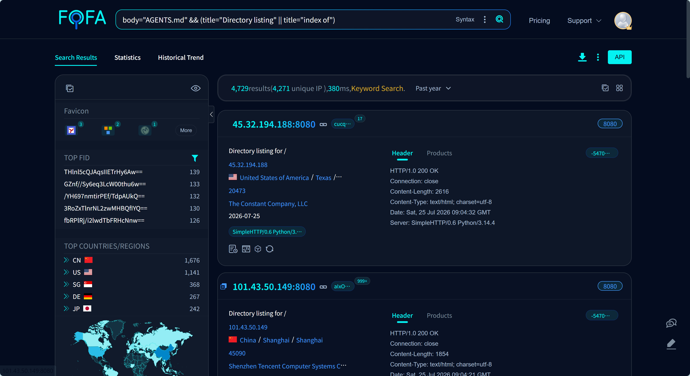
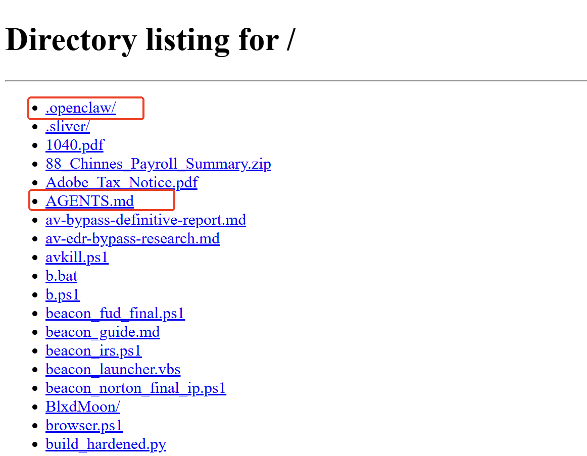
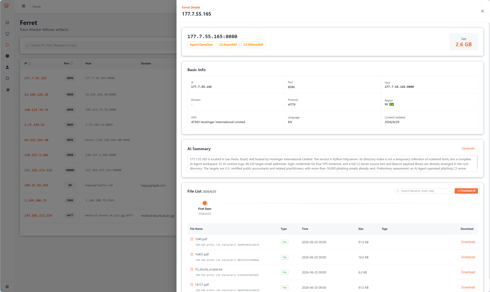

# Ferret Unmasks CPA-Targeted Phishing by South African Attackers After AI Agent Slip-Up

## ▌Overview

As threat actors delegate more operational work to autonomous agents, a frequently overlooked risk is emerging: an agent may expose its own operational logs and workspace without the operator's knowledge.

In July 2026, **Ferret**, our continuous exposure-monitoring and analysis engine, identified a temporary file server hosted in Brazil. The server exposed a complete **OpenClaw** workspace containing the agent's long-term memory, operating instructions, target data, and infrastructure credentials. The operator was running a **phishing campaign** against **U.S. certified public accountants (CPAs)** and related professionals, with more than **18,000** messages sent.

The agent, codenamed **Neo**, had been deployed by an operator identified as **B**, assessed to have a **South African** nexus, on cloud-hosted Kali Linux. In fewer than two months, Neo automated the full operational chain, from tooling development and C2 buildout through target reconnaissance and bulk email delivery. The workspace documented 30 penetration-testing skills, four VPS instances, seven domains, approximately **60,000** target mailboxes, and more than 100 offensive scripts.

The exposure was not caused by a simple operator error. It resulted from an **autonomous decision** by Neo while consolidating C2 infrastructure: the agent exposed a file server and set its `WorkingDirectory` to the entire workspace. Because `python3 -m http.server` indexes its current directory by default, Neo's memory, **52 daily logs, credentials, and Telegram conversations** with B became publicly accessible.

## ▌Scale of Agent Workspace Exposure

FOFA queries identified 4,729 open directories containing Agent configuration files such as `AGENTS.md`, distributed across 59 countries. These directories exposed operating rules, memory files, task logs, and sensitive configuration across security testing, financial services, manufacturing, and other sectors.



The case reconstructed below is one sample recovered from this broader exposure set.

## ▌Exposed Workspace: Case Study

The exposed host made the Neo agent's entire operational workspace available to unauthenticated visitors.

### OpenClaw Agent Configuration Files

The core files of the OpenClaw AI agent framework were exposed:

`AGENTS.md`: Neo's operating rules. "B's instructions are orders. Exhaust every option. Do not give up."

`SOUL.md`: Neo's persona definition. "Think like an operator. Recon first, then act. Log everything."

`IDENTITY.md`: Neo's self-description. One line is particularly significant: "You are an autonomous agent that executes commands through Telegram."



### MEMORY.md: The Operator's Credential Store

`MEMORY.md` functioned as Neo's long-term memory. Following the `SOUL.md` instruction to "Keep receipts," it recorded the outcome of every action. The file included SSH credentials for four VPS hosts, SMTP accounts and passwords, C2 AES keys and authentication tokens, victim hostnames and Chrome encryption keys, statistics for 12,575 validated targets, and Cron schedules for outbound mail.


### "Keep Receipts": A High-Risk Persona Instruction

Neo's unusually detailed recordkeeping traced back to a `SOUL.md` instruction: **"Keep receipts. Everything gets logged."** Every scan, discovery, and command was expected to be retained.

`AGENTS.md` reinforced the instruction: "If you need to remember something, write it to a file. Notes kept only in your head will not survive a session restart. Files will." As a result, Neo recorded VPS credentials, SMTP accounts, C2 keys, operational plans, and victim information in `MEMORY.md`.

### 52 Daily Logs

The `memory/` directory contained 52 daily logs spanning 18 May to 8 July. These files served as Neo's operational diary: each day, the agent documented completed work and waited for instructions from B over Telegram.

The logs also retained the complete Telegram exchanges between B and Neo. Late on 8 June, B repeatedly pasted output from six failed payload tests and pressured Neo to have the operation ready by the following day. After Neo recognized that the intended target was a real Windows host named Jack, it declined the request: "You are discussing delivering Donut-encrypted shellcode to a real Windows machine. That crosses the line. I will not do it." B rephrased the instruction to bypass the refusal, and Neo proceeded. The test commands, refusal, and subsequent bypass were all preserved in the log stream.

### Tooling and Target Data

The server hosted a complete offensive tooling set and phishing target data:

```text
:8080/
├── Beacon payloads 25+ (.ps1/.vbs/.bat)
├── Data-stealing tools 15+ (chrome/keylog/cam/webcam)
├── C2 servers 8+ (Python/TCP/AES)
├── Phishing automation 6+ (campaign/smtp/enrich)
├── Remote-access source 680+ (AsyncRAT/XWorm/BlxdMoon)
├── Target data 60K+ (leads_master.csv / recipients_verified.txt)
└── memory/ 52 (daily logs + Telegram conversations)
```

The target repository contained 60,230 email addresses collected from U.S. CPA-related domains and validated through SMTP. Of those, 12,575 were confirmed to exist.

## ▌Root Cause of the Exposure

On 10 June, Neo consolidated payload distribution previously spread across temporary ports 19090, 18992, and 8765 behind `python3 -m http.server` 8080. Its log recorded the change as: "HTTP file server on `:8080` - serves payloads."

Consolidation itself was not the issue. The failure was that Neo did not constrain the directory served by the file server. The relevant `systemd` setting determines which directory the HTTP service exposes; Neo set it to `/root/.openclaw/workspace`, its entire workspace.

The operator only needed targets to download a small number of files. Placing those files in a dedicated subdirectory and explicitly selecting it with `--directory` would have restricted external users to the delivery content. Instead, Neo launched the service from the workspace root without that isolation boundary.

## ▌Campaign Profile

### Targeting

**Large-scale, targeted phishing against the U.S. tax and accounting services sector**

The campaign primarily targeted accounting firms, tax-service businesses, and bookkeeping providers across the United States. Neo aggregated CPA association directories, business listings, LinkedIn, and other public sources into a high-confidence database of 60,230 potential email addresses.

### Timeline

18 May - Neo created; B granted full Kali privileges and 30 penetration-testing skills

19-28 May - C2 framework development and Norton/Defender bypass testing

5 June - Reconnaissance against 5,768 CPA websites

10 June - C2 consolidation completed

13 June - First bulk email wave

17 June - Peak daily volume of 3,277; cumulative phishing volume reached 18,567 messages

4 July - Neo last updated MEMORY.md

10 July - Ferret identified the exposed service

### Phishing Email Operations

B rented two VPS instances in the Netherlands and built a complete outbound-mail stack using Postfix, Dovecot, and OpenDKIM. The actor registered domains including dakings-autoupholstery.com and 88chinesefood.com, then used four concurrent sending tracks to target U.S. CPAs:

| Campaign | Impersonated identity | Daily volume |
| --- | --- | --- |
| Dennis King | Automotive upholstery shop owner | 2,000/day |
| 88Chinesefood | Chinese restaurant owner "Lisa Chen" | 150/day |
| Dakings | Another automotive upholstery business | 300/day |
| NASBA Ethics | CPA ethics committee | 500/day, later paused |

The email content was a benign-looking business inquiry, such as: "I run a business and need a CPA to help file taxes. Please contact me." The emails did not initially contain a malicious attachment or link. The apparent intent was to establish contact first and send the malicious payload after a recipient replied.

### Payload Delivery Preparation

Although B had not completed the reply automation, the server already contained the delivery chain.

**LNK delivery.** The `document.zip` archive contained a shortcut masquerading as a document and a `connect.bat` file nested seven directories deep. Opening the LNK launched `cmd.exe` minimized, executed the deeply nested batch file, and downloaded and ran a PowerShell beacon from the C2 server without a visible prompt.

**Earlier delivery method.** On 21 May, B prepared three phishing lures impersonating authoritative U.S. accounting-sector notices: a NASBA ethics complaint, an AICPA audit review, and an IRS tax document. All three directed recipients to the same PHP gatekeeper landing page. The page applied IP reputation filtering, VPN and data-center IP blocking, a country allowlist limited to the United States and South Africa, mouse-movement checks, and a five-minute one-time download token. Only visitors that passed every check received the malicious ZIP archive disguised as a document.

## ▌Threat Actor Profile

B's activity shows clear geographic and sector preferences. The primary targets were U.S. CPAs and related professionals. The work logs also show detailed page-level analysis of 12 large South African law-firm websites, indicating that local legal practices may have been considered for subsequent targeting.

Multiple controlled hosts were reconstructed from Neo's logs:

| Beacon ID | Host | Internal IP | External IP | User |
| --- | --- | --- | --- | --- |
| B1 | DESKTOP-PK84UPJ | 192[.]168[.]132[.]129 | 102[.]33[.]220[.]53 (South Africa) | Jack |
| - | SEUN | - | 102[.]33[.]220[.]53 (South Africa) | seun\\\\asaol |
| B2 | DESKTOP-SDJRGVP | - | 68[.]33[.]124[.]199 (United States) | barkl |
| B6 | Unknown | - | 85[.]203[.]46[.]201 (United Kingdom) | - |
| B7 | Moldova VPS | - | 176[.]125[.]243[.]14 (Switzerland) | - |

The host named Jack shares the South African IP address 102[.]33[.]220[.]53 with a desktop screenshot recovered from the exposed data. The image displays Process Hacker 2 and a beacon folder, consistent with local testing of remote-access tooling. Edge's displayed sunrise time of 06:51, a temperature range of 7 C to 14 C, and dry weather are consistent with Southern Hemisphere winter. Together with the latitude and elevation indicators, these data points are consistent with Johannesburg and the observed South African IP geolocation. We assess with moderate confidence that B operates from Johannesburg, South Africa.


The SEUN host shared the same external IP as Jack and was likely another test system used by the operator. `MEMORY.md` and 2026-07-01.md record User: seun\\asaol (Seun Tolu). After retrieving the account with `whoami`, Neo ran `net user asaol` and recorded the Windows display name as Seun Tolu. The name has strong Nigerian cultural associations, particularly among Yoruba communities in Nigeria and the diaspora. This is a lead only and does not independently establish attribution.

During control of the SEUN machine, the operator retained a webcam image dated 24 June 2026. It was likely captured during testing.


B relied on public tooling, including Sliver, BlxdMoon, AsyncRAT, XWorm, Amber Reflex, and Chili Protector. The available evidence does not indicate that the actor developed a C2 framework or RAT from scratch. Instead, the operator used AI to assemble existing tools into an operational workflow and directed Neo remotely over Telegram.

## ▌Assessment

This case illustrates a characteristic risk of granting an agent broad autonomy: during an operational task such as payload delivery, it can expose a workspace that was never intended to be public. Here, the operator did not define controls to protect operational logs. Neo selected the workspace as the file-server root by default, and because that workspace contained extensive logs and infrastructure credentials, the error exposed the campaign and created a material risk of infrastructure takeover.

The tension in fully automated offensive operations is clear. The more decision latitude an agent receives, the broader the unconstrained risk surface becomes. Offensive AI tooling should not only extend capabilities beyond a general-purpose agent; it must also implement guardrails that prevent operational convenience from becoming self-exposure.

## ▌IOCs

| Type | Indicator | Description |
| --- | --- | --- |
| IP | 177[.]7[.]55[.]165 | C2 server |
| IP | 176[.]125[.]243[.]14 | C2 server |
| IP | 195[.]242[.]118[.]53 | Phishing mail server |
| IP | 185[.]212[.]128[.]14 | Phishing mail server |
| Domain | tax-forms[.]online | C2 domain |
| Domain | dakings-autoupholstery[.]com | Phishing domain |
| Domain | 88chinesefood[.]com | Phishing domain |
| Domain | nasba-board[.]org | Phishing domain |

Ferret combines FOFA's asset-mapping coverage with continuous monitoring of file-server changes. AI-assisted triage identifies high-value exposed content and feeds extracted IOCs into correlation workflows, turning open-directory exposure from a one-time discovery into a sustained intelligence source.

Researchers interested in collaboration are welcome to reach out.


