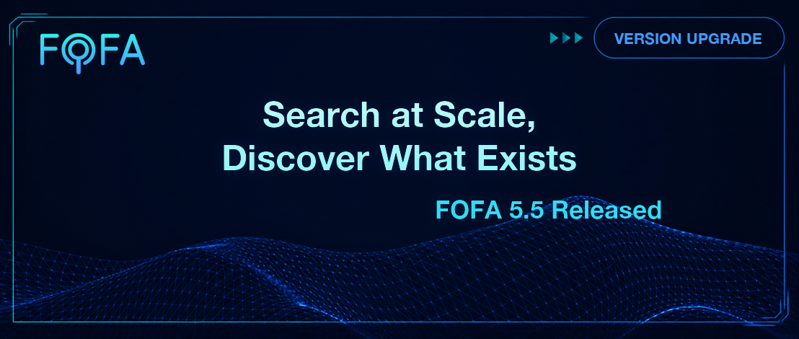
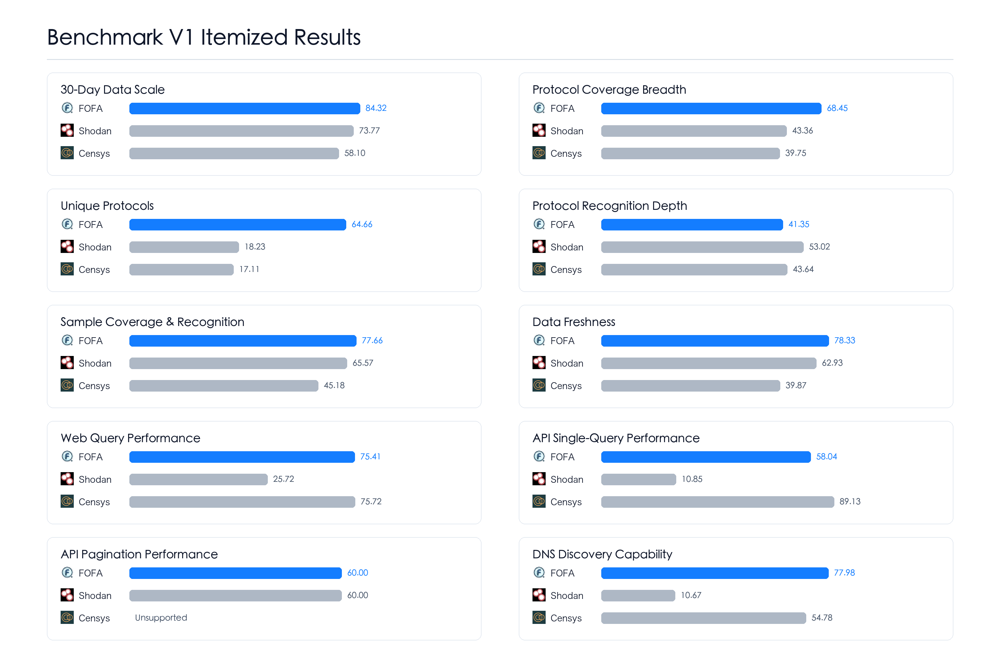
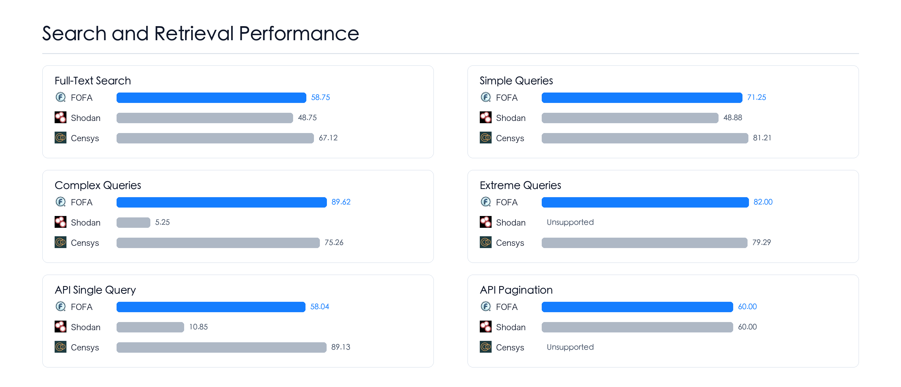
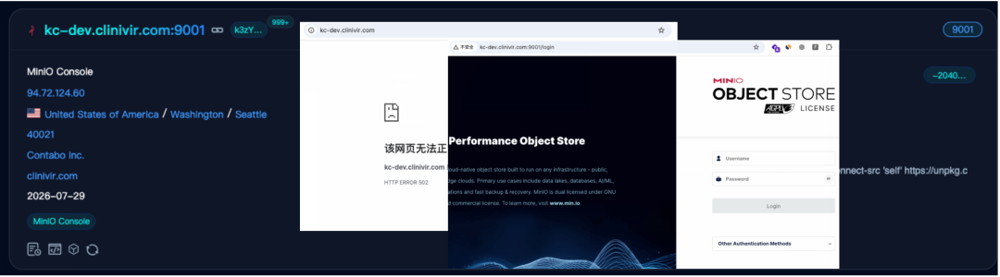
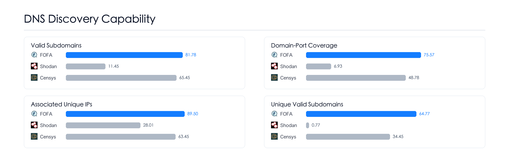
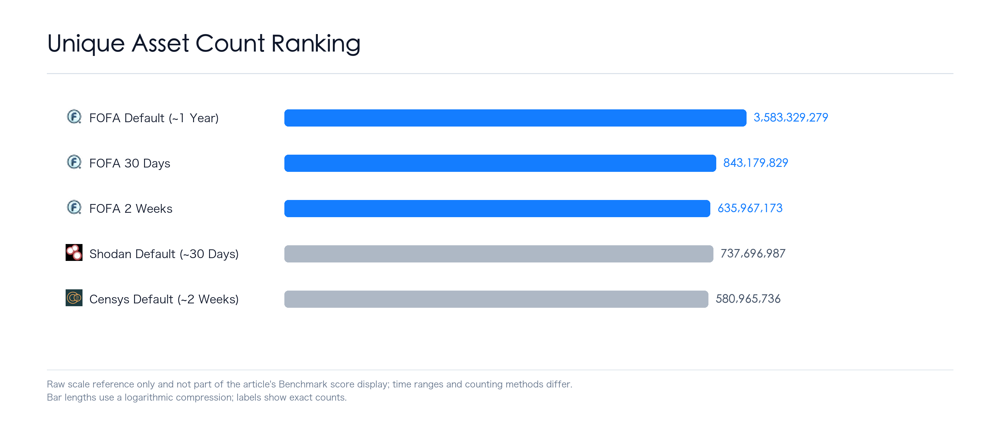

# Search at Scale, Discover What Exists: FOFA 5.5 Released

*Faster Search, More Proactive Discovery*

## Foreword

Cyberspace mapping has an inescapable reality: assets keep growing.

In the first seven months of this year, FOFA's new registered users reached **144%** of last year's full-year total. Users are growing, and so is the data. Growth is good, of course—but growth is never free. Every time the data scale crosses a new threshold, search has to pass the exam all over again. Even a routine complex query can take longer and longer, and sometimes fail outright.

The domain problem is more subtle. Some subdomains were never discovered; some assets are already in the database, but searching by domain returns nothing—not because they do not exist, but because the path between domain, IP, and port was never connected.

Two problems, different solutions, but the same principle: **Technology has ceilings it cannot break through; resources have answers they cannot buy. Two legs—neither can be missing.**

Progress is not something we can judge by comparing only against ourselves. That can tell us "we got better," but only an industry-level comparison can tell us "where we stand." That is why we established the **Cyberspace Mapping Platform Benchmark V1 Evaluation Standard**.

This Benchmark starts with Shodan and Censys. We have continued to watch the progress of other platforms over the past two years, and some have built clear strengths. We have not yet completed testing under the same conditions, so they are not included in this round.

This release focuses on two major improvements: making search within the default scope faster and more stable, and finding more real subdomains.

## I. Search Performance Improvements

First, search performance.  
Different platforms handle data scale differently. Shodan primarily displays assets from the past 30 days and does not support complex cross-feature queries. Censys displays assets from the past two weeks, officially described as "known assets"; individual users have limited access to product functionality, and the product primarily serves enterprise customers. FOFA displays assets from the past year by default, while keeping all historical assets searchable. FOFA therefore has to handle the performance pressure created by billions and tens of billions of records.

We initially tried to shoulder this pressure through technology upgrades alone. We tried. It was not enough. Once both data scale and user volume reach this level, pure technical optimization hits a ceiling.

This release therefore upgrades both software and hardware, expanding and restructuring the entire search pipeline. The first batch of improvements focuses on the default scope—the data users encounter first and use most frequently when they open FOFA.

For search and retrieval performance, the Benchmark comparison results are shown below:

The upgrade for searches across longer historical time ranges will also be completed soon.

## II. Proactive Discovery of High-Value Domains

If performance is where technology hits a ceiling, domain discovery is where resources hit a boundary.

"Not discovering enough" refers to base domains and the subdomains behind them. The most straightforward industry approach is to pile on resources—specifically, DNS databases. FOFA has taken this path and will continue to do so.

But there is a reality that cannot be bypassed: no one can buy all the DNS data in the world. Regional services, temporary deployments, third-party systems, and newly emerged entry points will always fall outside existing coverage. The amount that resources can accumulate is always limited; the rest has to be found through technology. Domain discovery cannot rely solely on stockpiling databases—it needs its own discovery capability.

FOFA chooses to direct proactive discovery toward high-value domains. What counts as a high-value domain? We consider high-traffic domains and domains belonging to publicly listed companies to be high-value. These domains automatically enter the high-value domain pool, receive faster update cycles, and are processed by FOFA's in-house subdomain discovery program.

**Adaptive Dynamic Dictionary Pool.** Using the high-value domain pool, FOFA turns years of accumulated subdomain prefixes into a dynamic dictionary that adapts to the characteristics of different domains. It is used to discover more subdomains, including those that resource-based methods cannot reach.

There is another category of problems: assets are in the database, but domain search returns nothing.

- Some domains have their main port closed, with services only on non-standard ports—previously, these were discarded as "unreachable" during ingestion;
- Users search by domain and find nothing, forcing them to pivot to IP and work backwards;
- The same service, accessed via IP+port versus domain+port, returns different content.

**Non-standard Port Domain Binding** fills in the binding between domains and non-standard ports. Assets are no longer discarded during ingestion, users can find them by searching the domain directly, and domain+port access returns the correct response.

These capabilities are not just about making subdomain lists longer. They make real entry points that were drifting outside asset inventories visible again.

After this round of upgrades, we selected samples from publicly listed companies and high-traffic domains. The internal Benchmark results are shown below:

The results show that Shodan continues to focus on protocol recognition, while DNS discovery remains outside its primary emphasis. Censys continues to invest in DNS, and its progress is already visible.

First find the subdomains, then connect domains to services, so users no longer have to detour repeatedly because of a broken record.

But this road is not finished. As proactive discovery finds more assets, wildcard resolution and other issues appear as well, affecting the proportion of valid results. This release pushes "finding more" one step forward; in the next release, FOFA will continue to make "finding accurately" more solid.

## III. Other Updates

In addition, this release includes the following:

- Mobile adaptation, supporting the full workflow from search to data download;
- Deduplication of web assets and HTTP/HTTPS protocol data;
- 100+ new rule products;
- New and optimized protocols: ZMTP, RTCM, Zeroconf, mDNS, Socks, ethereum-p2p, ethereumrpc, P4, and more;
- UX improvements;
- Bug fixes.

## In Closing

The game of wits with assets never stops.

They multiply, they migrate, they hide on non-standard ports, and they lurk behind domains. You think you have seen the full picture, and then a new entry point appears where you least expect it. This is not a system malfunction—it is the nature of cyberspace. Assets do not sit neatly on an inventory waiting for you to flip through.

This release delivers two answers. Search is faster now, but it still needs to cover longer time ranges; domains are being found, but accuracy still needs to improve. Technology has ceilings it cannot break through; resources have answers they cannot buy—but these two legs cannot stop. The moment they do, another entry point slips out of sight.

Time was limited, and many peer capabilities worth learning from were not included in this Benchmark. Shodan's depth in comprehensive protocol recognition, screenshots, and smooth historical-trend features; Censys's fine-grained field design, IP-centric historical trends, and port-change views; and domestic peers' website-rendering recognition, very high coverage for individual protocols, multi-hop redirect records, and IP geolocation accuracy—all have distinct strengths, and some are already ahead in those areas.

Cyberspace mapping is nowhere near finished. Everyone is pushing the boundary in a different direction. May we keep making the field better together.

Not finding it does not mean it does not exist. Letting every real entry point be seen, no matter which port it is hidden on or how many domain layers it sits behind—this has no finish line. FOFA will keep at it.

## Acknowledgments

Many of the changes in this release started with user feedback—not just the search and domain lines covered here, but also a large volume of everyday UX suggestions and issue reports. Thanks to the following community members, in no particular order:

keyouth, 🌟, 蜗牛, づ听风看月, Mellifluous, J14n, XIAO\*\*\*\*aa, sh\*\*\*ian, Fo\*\*\*\*LegYi, ric\*\*\*ng, \*前, \*凡, 李\*, 随性, 菱形雪, 幾許風雨, Zther0, 依莱, 冰桉, Alex, 苏西, Reigniting, 穿鞋跑得快, 南风, and the community members whose display name is "."

## Appendix

### Data Scale Reference

The following figure presents each platform's raw data scale and includes FOFA at multiple time ranges for comparison. It is provided for reference only and does not contribute to Benchmark scores.

---

For the complete evaluation dimensions, methodology, and definitions, see the [Cyberspace Mapping Platform Benchmark V1 Evaluation Standard](https://github.com/FofaInfo/Awesome-FOFA/blob/main/Benchmark/cyberspace-mapping-platform-benchmark-v1.en.md).

Benchmark is not a one-time exercise. We will continue to iterate on the evaluation dimensions and comparison methodology, and update the results regularly.
