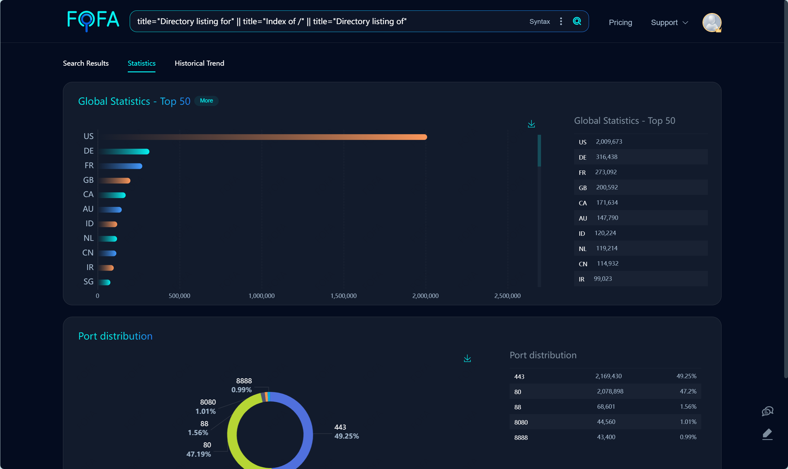
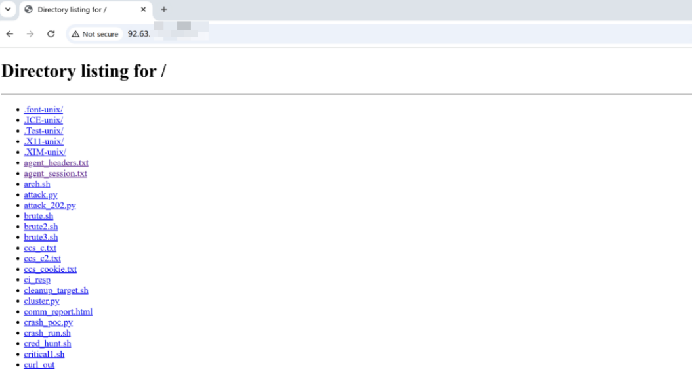
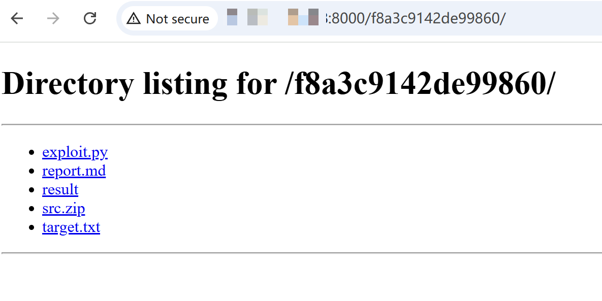
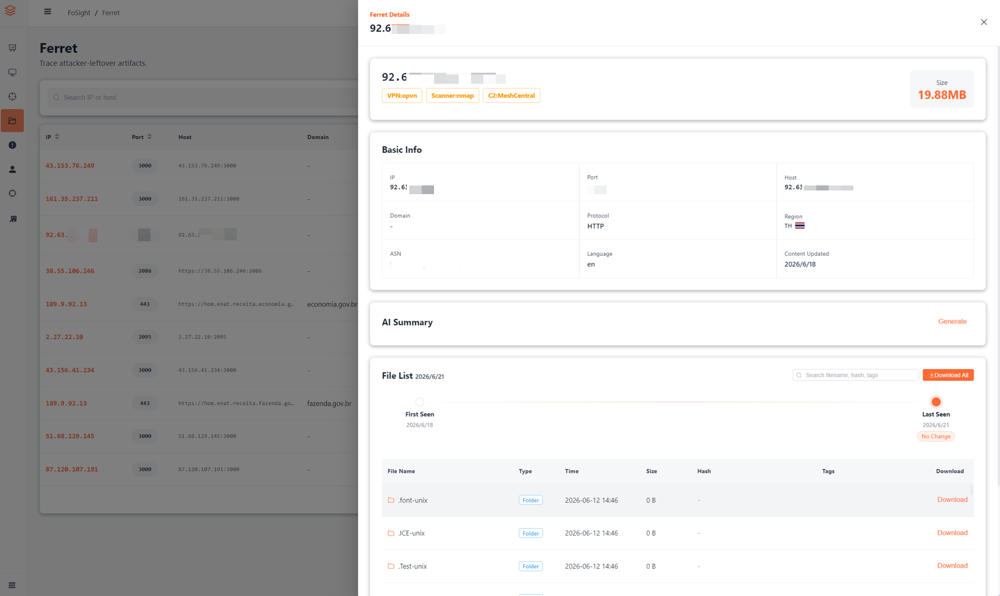

# Threat Hunting in Open Directories

Uncovering Intrusion Activity Targeting Multiple Thai Organizations Through an Attacker's Oversight

## ▌Executive Summary

Open directories are typically discussed as victim-side misconfigurations. However, security testers and even Advanced Persistent Threat (APT) actors can expose their own operational artifacts through a single careless file-serving instance. The recent **FortiBleed** incident, which affected over 70,000 Fortinet firewalls globally, was uncovered through an open directory left exposed on the public internet. For defenders, these open directories represent an excellent low-cost avenue for counter-intelligence and attribution.

In our recent research, using **Ferret**, our open directory analysis engine built on the FOFA asset mapping platform, we discovered a threat actor's file server exposed on the public internet. The server contained detailed operational artifacts and a list of compromised assets. From this data, we reconstructed an activity cluster affecting **Thailand's Ministry of Finance, Triple T Broadband PCL**, and multiple other organizations, which we track as **AyutMesh**. The leaked files exhibit clear indicators of **AI-assisted attack** activity. Together with other cases captured by Ferret, this suggests a broader shift in attack operations from "manual orchestration" to "AI-automated iteration": threat actors can use AI to rapidly generate, modify, and expand intrusion scripts, expanding their attack coverage at lower cost even without zero-day exploits. We will continue to produce threat hunting intelligence through Ferret.

## ▌Why Temporary File Servers Keep Getting Exposed

### The Underestimated Open Directory

Open directories have never been low-value intelligence sources; they are simply underestimated by the people who create them. Based on the past year of internet asset mapping data, over one million server IPs with exposed directory indexes exist across the majority of countries. Not all are related to penetration testing, but this exposure pattern is common enough to warrant serious attention.



This type of exposure is not limited to small VPS instances or personal projects. In the FortiBleed incident disclosed in June 2026, security researcher Bob Diachenko discovered an open directory belonging to a Russian-speaking criminal group exposed on the public internet. It contained the results of their campaign: a credential database covering **194 countries** and approximately **75,000** FortiGate firewalls. It was precisely this careless exposure of the attackers' own infrastructure that revealed a massive intrusion campaign affecting nearly half of all internet-facing Fortinet devices.

On temporarily deployed file servers, a seemingly ordinary directory page may contain configuration files, archives, scanning scripts, and result reports. For the operator, it is merely a temporary file transfer; for an external observer, filenames, directory structures, timestamps, and tool artifacts may be sufficient to reconstruct a complete operational chain and further identify targets, infrastructure, and attack techniques.

| File Type | Potentially Exposed Information |
| --- | --- |
| Configuration files | Service addresses, credentials, paths, infrastructure settings |
| Archives | Toolkits, project backups, sample collections, historical materials |
| Scanning scripts | Targets, automation logic, tool usage patterns |
| Result reports | Target assets, vulnerability findings, verification processes, timelines |

### Temporary File Servers in Red Team Operations

In penetration testing and red team engagements, temporary file servers are a common class of infrastructure. The reasons typically boil down to three points:

- **Payload delivery**: Target environments need to download verification scripts, toolkits, or dependencies; HTTP is the most direct and compatible method.
- **Team staging**: Team members need to share screenshots, scan results, and reproduction materials; a temporary file directory is more convenient than repeatedly passing archives.
- **Result viewing**: HTML, CSV, and JSON reports generated by scanners need quick review; serving them directly via a web directory is the path of least resistance.

Compared to cloud storage, SFTP, Git repositories, or collaboration platforms, HTTP has the lowest environmental requirements because browsers, `curl`, and `wget` can all access it directly. Many file servers are not intended for "public sharing" but simply to move files where they need to go as quickly as possible.

### One Line of Python: Convenience and Risk

This is why `python -m http.server` remains so prevalent. Python is pre-installed on most servers and testing environments, and `http.server` is part of the standard library, with no third-party dependencies required.

```bash
python3 -m http.server 8000
```

Execute this single command in any directory, and it instantly becomes an HTTP file service. Change into a directory, run the command, and the service is immediately available.

The risk stems from this same simplicity: if you start the service directly in a project directory, what gets exposed is not just a single file, but the entire working directory.

```text
project/
├── config.ini
├── tools.zip
├── scan_result.html
├── target.txt
└── report_draft.docx
```

When the startup cost is negligible, access control, directory boundaries, and shutdown procedures are easily forgotten. A "quick file transfer" can become a long-term publicly exposed working directory.

This risk is not confined to security testers. Threat actors also need to stage tools, distribute scripts, store results, and sync configurations, and they similarly spin up temporary file servers for convenience. These ad-hoc directories are rarely organized; filenames, directory structures, timestamps, configuration remnants, and command output retain far more raw operational traces.

When the exposed file server belongs to an attacker, the open directory is no longer just a leak. It becomes an entry point into the attack chain. These traces, connected together, can lead from an ordinary directory page to infrastructure, C2 systems, and victim scope analysis.

## ▌Threat Intelligence from a File Server: A Case Study

During our continuous tracking of this file server, we found that the activity it points to does not currently match any publicly known APT intelligence. For ease of reference, we track it as the **AyutMesh activity cluster**. The name derives from two relatively stable indicators: the MeshCentral C2 domain `ayut****.com`, and the attacker's use of MeshCentral for persistent remote access and asset management.

What makes AyutMesh noteworthy is not the use of rare zero-day exploits. On the contrary, the leaked files show that the actor relies more on known vulnerabilities, common enterprise application entry points, and remote access platforms, while rapidly iterating AI-assisted automation scripts. The leaked MeshCentral export data already shows compromised or managed servers across multiple countries and industries, involving 3BB, Thailand's Ministry of Finance, Chonburi Provincial Office of Learning Encouragement, as well as educational institutions and manufacturing-related assets.

This is not the result of low-skill automation scripts stumbling upon targets. More accurately, it demonstrates the amplification effect when a capable threat actor layers AI automation on top of existing skills: the barrier to attack is lowered, iteration accelerates, and attackers can expand their footprint at lower cost without relying on zero-day exploits. At the same time, as operational tempo increases and temporary infrastructure is frequently created and discarded, oversights like forgetting to shut down a file server become more likely.



### AyutMesh Activity Timeline

The significance of these files lies not in any single script, but in the fact that file timestamps and action types corroborate each other. In chronological order, the major actions of AyutMesh are as follows.

| Time | Phase | Key Indicators |
| --- | --- | --- |
| 2026-06-02 AM | 3BB-related web entry point probing | `***.3bb.co.th` SQL errors, `***.3bb.in.th` legacy PHP environment indicators |
| 2026-06-02 PM | On-host deployment and remote access setup | Dirty COW, PwnKit, WebShell, MeshAgent configuration and cleanup scripts |
| 2026-06-03 | 3BB public-facing services and perimeter device validation | CodeIgniter, FortiGate SSL-VPN, F5/WAF, session forgery, path enumeration |
| 2026-06-09 | Internal address range and enterprise component expansion | `10.11.*` targets, SSH, MySQL, phpMyAdmin, Pentaho/Kettle, Tomcat/Ghostcat |
| 2026-06-10 | MeshCentral export data leaked | `devices.json`, command output, compromised asset inventory |
| 2026-06-11 | Continued probing of multiple services | Redis, Jenkins, Roundcube, Keycloak, MongoDB, Nmap results, etc. |

Files from the afternoon of June 2 indicate the attacker was not merely conducting external reconnaissance. Local privilege escalation exploits, WebShells, MeshAgent configurations, and cleanup scripts all appeared simultaneously, confirming host-side operations on at least one 3BB-related machine. Subsequent files are no longer initial scanning records starting from zero, but operational traces of continued expansion from an established foothold.

The distinction between June 3 and June 9 lies in the shift in target scope. June 3 files focus on `****.3bb.co.th`, `****.3bb.co.th:10443`, and related web entry points, with an emphasis on public-facing business systems and perimeter device validation. Starting June 9, numerous `10.11.*` addresses, database services, phpMyAdmin, Pentaho/Kettle, and Tomcat/Ghostcat appear, indicating a pivot toward internal address ranges and enterprise components.

The `devices.json` leaked on June 10 shifts the perspective from a single host to the attacker's control console. 64 compromised or managed nodes are organized by organization and region, with 3BB-related assets grouped under `TH-3bb`; beyond this, asset pools belonging to other organizations in Thailand and India are also visible. This means the file server exposed not just a single operation against 3BB, but the attacker's broader remote access footprint.

### From Scripts to Remote Control: The Attack Chain

The files do not reveal a single linear exploit chain, but rather multiple paths advancing in parallel. The visible directions include:

- **Public-facing application enumeration**: SQL errors, business path enumeration, CodeIgniter session-related attempts.
- **Perimeter device validation**: Verification and exploitation attempts targeting FortiGate SSL-VPN `CVE-2024-21762`.
- **Legacy vulnerability exploitation**: F5 BIG-IP TMUI `CVE-2020-5902` probing, Tomcat AJP Ghostcat `CVE-2020-1938` scripts.
- **Local privilege escalation**: Dirty COW `CVE-2016-5195`, PwnKit `CVE-2021-4034` related files.
- **Enterprise application exploitation attempts**: phpMyAdmin, MySQL file writes, Pentaho/Kettle, Tomcat/JSP, etc.
- **Persistence and remote access**: WebShell artifacts, MeshCentral Agent deployment.
- **Control console asset management**: `devices.json` leaking 64 compromised or managed nodes.

The highest-confidence indicators are concentrated in WebShell artifacts, MeshAgent configurations, cleanup scripts, `devices.json`, and `got63.txt`. The FortiGate, F5, and Ghostcat directions are better characterized as verification and exploitation attempts. Overall, the attacker was simultaneously probing public-facing entry points and perimeter devices for breach opportunities while escalating privileges, establishing persistence, and connecting to remote access infrastructure within already-compromised environments.

### MeshCentral Control Plane

Multiple MeshCentral-related artifacts appear across the file set, including Agent configurations, installation scripts, cleanup scripts, control console export data, and command output. Together, these files show the attacker using MeshCentral to access hosts, maintain persistent remote control, and manage compromised assets.

| Artifact | Significance |
| --- | --- |
| `meshagent.msh` | MeshAgent configuration file |
| `www.ayut****.com` | MeshCentral C2 domain |
| `devices.json` | Control console inventory of compromised or managed assets |
| `got63.txt` | Command execution output |
| `cleanup_target.sh` | Cleans operational traces while preserving remote access services |

The attacker is not relying solely on one-time script execution, but has connected certain hosts to a persistent remote access panel for sustained use.

The files also contain hidden PHP backdoor and cleanup script artifacts, indicating the attacker did not stop at the reconnaissance phase but engaged in host-side deployment and artifact cleanup.

### Scope of Impact

Among the affected assets, evidence is most complete for 3BB-related hosts. 3BB's official name is Triple T Broadband PCL. The file server contains extensive operational files related to attacks against 3BB, and MeshCentral shows related hosts checking in. The exported `devices.json` contains **64 compromised or managed nodes**; beyond 3BB-related assets, multi-category asset indicators from Thailand and India are also visible.

The following table lists only those entries with relatively clear organizational attribution:

| Category | Organization Indicator | Basis for Assessment |
| --- | --- | --- |
| Confirmed compromise | Triple T Broadband PCL (Thailand) | Extensive operational files related to attacks against 3BB on the file server; MeshCentral shows host check-in |
| High-probability compromise | Thailand's Ministry of Finance, Chonburi Provincial Office of Learning Encouragement, Thai Isuzu-related systems | MeshCentral export groupings corroborated by IP-to-organization mapping |
| Medium-probability compromise | Thaksin University, King Mongkut's University of Technology North Bangkok | MeshCentral export group descriptions |
| Suspected compromise | Fujitsu, crowntex, zenitex, IFinix, Raj | MeshCentral export group naming and hostnames |

FortiGate firewall assets represent another notable focus area. Multiple FortiGate-related assets are visible among the compromised or managed IPs, and the file server retains verification and exploitation attempts targeting FortiGate SSL-VPN `CVE-2024-21762`. No obvious zero-day weaponization characteristics were found in the current file set; the overall pattern reflects high-frequency iterative testing centered on known vulnerabilities, legacy vulnerabilities, and common enterprise application entry points. Combined with the FortiBleed incident mentioned earlier, FortiGate devices are clearly becoming a shared focus across multiple distinct threat groups. Whether for mass credential harvesting or targeted intrusion, perimeter firewalls remain the preferred entry point.

### AI Automation Artifacts

The most striking characteristic of this file set is not any advanced exploit, but the density of automated iteration. Within short timeframes, large numbers of scripts targeting different components were generated in rapid succession, with highly consistent naming conventions, output formats, and comment styles.

| Observation | Evidence | Assessment |
| --- | --- | --- |
| Batch generation | Numerous `sqli*`, `forti*`, `test*`, `deep*` scripts appeared within a two-hour window on 2026-06-03 | High degree of automation |
| Iterative naming | Files named `final`, `verify`, `crash`, `rce_attempt` appear in sequence | Rapid trial-and-error |
| Report-style output | Keywords such as `VERDICT`, `SUMMARY`, `Conclusion`, `Expected behavior` | Clearly templated |
| Reasoning-style comments | Scripts retain failure explanations and next-step descriptions | AI-assisted indicators |
| Broad-spectrum coverage | Simultaneous coverage of multiple enterprise component types | Checklist-driven approach |

These scripts do not merely send requests. They embed textual output such as "expected behavior, test phase, verdict, risk assessment" within the script itself, exhibiting clear report-style and templated characteristics. Some scripts also retain failure reasons and next-step plans, a pattern inconsistent with one-off manually written scripts and more consistent with batch-generated output.

No specific AI product names, model identifiers, or generation logs appear in the current file set, so the exact tooling cannot be confirmed. However, the combination of rapid batch generation, reasoning-style comments, cross-component checklist-style enumeration, and the "test - assess - summarize" report-style pattern within scripts collectively supports a high-probability assessment that this activity cluster leveraged AI-assisted attack capabilities.

### Origin IP Behind the C2 Domain

The MeshCentral C2 domain found in the leaked files is `www.ayut****.com`. Querying FOFA with `host="ayut****.com"` reveals that the domain was associated with the Thai IP `157.85.***.***` in January 2026. Although the domain currently resolves through Cloudflare, this IP remains directly accessible, and its certificate information still displays `www.ayut****.com`.


Using FOFA data, the origin IP behind the C2 domain's CDN/proxy layer was successfully identified as `157.85.***.***`.

### IOC

| Type | IOC | Description |
| --- | --- | --- |
| IP | `92[.]63[.]***[.]***` | Exposed operational server |
| Domain | `www[.]ayut****[.]com` | MeshCentral C2 domain |
| IP | `157[.]85[.]***[.]***` | C2 real IP identified via FOFA |
| Artifact | `meshagent.msh` / `meshagent` service | Host-side forensic indicator |

AyutMesh is not merely a point-in-time vulnerability validation exercise, but a sustained iterative campaign centered on perimeter devices, common enterprise applications, and remote access platforms. The cluster demonstrates notably high interest in FortiGate firewall assets. No obvious zero-day weaponization artifacts were found on the file server; the activity exhibits characteristics of leveraging AI automation to accelerate intrusion iteration.

## ▌Low-Cost Measures to Reduce Exposure Risk

The same exposure risk exists on the security tester's side. The reason `python -m http.server` is so widely used comes down to convenience: it ships with the standard library, requires no installation, and launches with a single command. However, it has no built-in authentication or access control mechanism; once started, anyone can access the directory contents. Two common mitigation approaches exist, each with trade-offs:

| Approach | Trade-off |
| --- | --- |
| Custom script with authentication logic | Requires writing and carrying an additional script; no longer a one-liner |
| Alternative file server with built-in access control | Requires additional installation and configuration; more complex in temporary or constrained environments |

Both approaches solve the problem but sacrifice the "enter directory, one-line launch" convenience. For ad-hoc file transfers, any additional step reduces adoption probability, which is precisely why `http.server` is so difficult to fully replace.

How can basic security be achieved while preserving this convenience? One option leverages a built-in behavior of `http.server`: when a directory is accessed, it first looks for `index.html`. If present, it serves that file; if absent, it generates a directory listing.

```bash
echo 404 > index.html
python3 -m http.server 8000
```

The root path will no longer automatically list the directory contents. When a visitor opens `http://ip:8000/`, they see the contents of `index.html` rather than all files in the current directory.


For an additional layer, place actual files in a subdirectory with an unguessable name, for example:

```text
webroot/
├── index.html
└── f8a3c142de99860/
    ├── exploit.py
    ├── report.md
    ├── result/
    ├── src.zip
    └── target.txt
```

Then point the server at this temporary web root using `--directory`:

```bash
python3 -m http.server 8000 --directory ./webroot
```

Now accessing the root path will only hit `webroot/index.html`, while anyone who knows the path can access `/f8a3c142de99860/` and browse the shared directory normally. The path effectively serves as a simple access token.



## ▌From Discovery to Continuous Operations

The analysis path described above, from discovering an open directory to reconstructing the toolchain and correlating infrastructure, is the process of converting a single exposure into actionable intelligence. However, these directories often have limited lifespans, making manual tracking unsustainable.

Our open directory analysis engine Ferret systematizes this process. Leveraging FOFA's asset mapping capabilities, it monitors file server asset changes, uses AI summarization to rapidly identify high-value content, and feeds extracted IOCs into correlation analysis workflows, transforming open directories from one-time discoveries into a sustainable intelligence source. We will continue sharing valuable threat intelligence through this engine. Researchers interested in collaboration are welcome to reach out.



Open directories are an attacker's oversight and a defender's window of opportunity.
